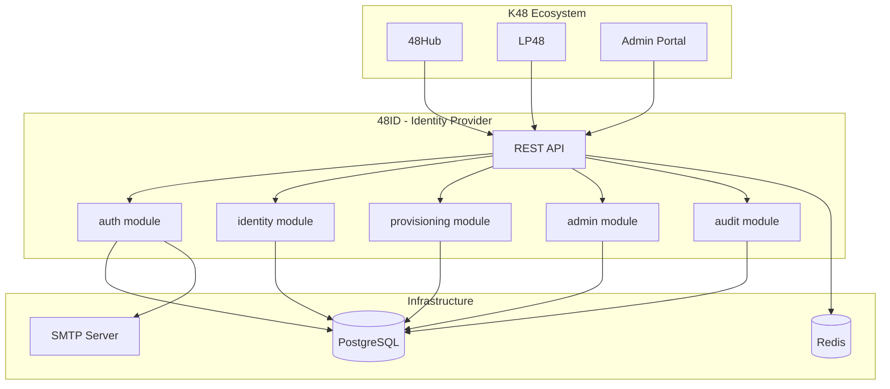

<div align="center">

# 🔐 48ID

**The Identity Provider for the K48 Ecosystem**

[](https://github.com/mrvin100/48id/actions)
[](LICENSE)
[](https://openjdk.org/projects/jdk/21/)
[](https://spring.io/projects/spring-boot)

Centralized authentication, user management, and identity services powering the K48 ecosystem.

[Documentation](docs) • [Quick Start](#quick-start) • [API Reference](docs/api) • [Contributing](CONTRIBUTING.md)

</div>

---

## 🌟 Overview

**48ID** is the identity backbone of the K48 ecosystem, providing secure authentication and user management for:

- 🎓 **[48Hub](https://github.com/mrvin100/48hub)** — Alumni verification and networking platform
- 🚀 **[LP48](https://github.com/mrvin100/lp48)** — Student project showcase platform
- 🔧 **Future K48 applications** — Extensible identity layer for the ecosystem

### What 48ID provides

| Feature | Description |
|---------|-------------|
| 🔑 **Authentication** | JWT-based login, refresh tokens, account activation |
| 👤 **User Management** | Profile administration, role-based access control |
| 📊 **Provisioning** | CSV-based bulk user import with email activation |
| 🔐 **API Integration** | API keys for trusted backend services |
| 📝 **Audit Logging** | Complete audit trail for security and compliance |
| 🔒 **Security** | Password policies, rate limiting, token validation |

---

## 🏗️ Architecture

48ID is built with **Spring Modulith** to enforce clean module boundaries and maintainability.



### Module structure

```text
io.k48.fortyeightid
├── auth/          → Authentication, JWT, password reset, activation
├── identity/      → User entity, profiles, roles, status
├── admin/         → Admin operations, API key management
├── provisioning/  → CSV import, bulk user creation
├── audit/         → Audit logging and history
└── shared/        → Security, exceptions, infrastructure
```

---

## ⚡ Quick Start

### Prerequisites

- **Java 21+**
- **Docker & Docker Compose**
- **SMTP server** (or use [MailHog](https://github.com/mailhog/MailHog) for local dev)

### 1. Clone and configure

```bash
git clone https://github.com/mrvin100/48id.git
cd 48id
cp .env.example .env
```

Edit `.env` with your database and SMTP settings.

### 2. Start infrastructure

```bash
docker compose up -d
```

This starts PostgreSQL and Redis locally.

### 3. Run the application

```bash
./gradlew bootRun
```

**Windows:**
```powershell
.\gradlew.bat bootRun
```

### 4. Verify it's working

- **API:** http://localhost:8080/api/v1
- **Swagger UI:** http://localhost:8080/api/v1/docs
- **Health:** http://localhost:8080/actuator/health
- **JWKS:** http://localhost:8080/.well-known/jwks.json

---

## 🚀 Integration

### For user-facing apps (48Hub, LP48)

```javascript
// 1. Login
const response = await fetch('http://localhost:8080/api/v1/auth/login', {
  method: 'POST',
  headers: { 'Content-Type': 'application/json' },
  body: JSON.stringify({
    matricule: 'K48-2024-001',
    password: 'userPassword'
  })
});

const { access_token, refresh_token } = await response.json();

// 2. Use access token
const profile = await fetch('http://localhost:8080/api/v1/me', {
  headers: { 'Authorization': `Bearer ${access_token}` }
});
```

### For backend services

```bash
# Verify user token server-to-server
curl -X POST http://localhost:8080/api/v1/auth/verify-token \
  -H "X-API-Key: your-api-key" \
  -H "Content-Type: application/json" \
  -d '{"token":"user-jwt-token"}'
```

👉 **[Full Integration Guide](docs/guide/integration.md)**

---

## 📚 Documentation

| Section | Description |
|---------|-------------|
| **[Guide](docs/guide)** | Introduction, architecture, authentication, deployment |
| **[API Reference](docs/api)** | Complete endpoint documentation |
| **[Developers](docs/developers)** | Contributing, testing, development workflow |

**Quick links:**
- [What is 48ID?](docs/guide/introduction.md)
- [Architecture overview](docs/guide/architecture.md)
- [Authentication flows](docs/guide/authentication.md)
- [API overview](docs/api/overview.md)
- [How to contribute](CONTRIBUTING.md)

---

## 🛠️ Tech Stack

- **Backend:** Spring Boot 3, Spring Security, Spring Modulith
- **Database:** PostgreSQL 17 + Flyway migrations
- **Cache:** Redis
- **Auth:** JWT (RS256), refresh tokens, API keys
- **API Docs:** Springdoc OpenAPI (Swagger UI)
- **Testing:** JUnit 5, Mockito, Testcontainers
- **Build:** Gradle, Docker

---

## 🤝 Contributing

We welcome contributions! Whether it's bug fixes, new features, or documentation improvements.

**Get started:**
1. Read the [Contributing Guide](CONTRIBUTING.md)
2. Check the [Story Implementation Workflow](docs/developers/story-workflow.md)
3. Follow our [Code Standards](docs/developers/contributing.md#coding-standards)

**Development setup:**

```bash
# Run tests
./gradlew test

# Check module boundaries
./gradlew test --tests ApplicationModularityTests

# Build
./gradlew build
```

---

## 📋 Project Status

This repository implements the **MVP scope** of 48ID:

✅ JWT authentication and refresh tokens  
✅ Account activation with email  
✅ Password reset and change flows  
✅ CSV user provisioning  
✅ Admin user management  
✅ API key management  
✅ Audit logging  
✅ Public identity endpoints for integration  

**Future roadmap:**
- OAuth 2.0 / OpenID Connect support
- Social login providers
- Multi-factor authentication (MFA)
- SCIM provisioning
- Advanced RBAC with custom permissions

---

## 📄 License

This project is licensed under the [MIT License](LICENSE).

---

## 🙏 Acknowledgments

Built with ❤️ by the K48 Team for the K48 ecosystem.

**Part of the K48 ecosystem:**
- [48Hub](https://github.com/mrvin100/48hub) — Alumni verification platform
- [LP48](https://github.com/mrvin100/lp48) — Project showcase platform
- **48ID** — Identity provider (this repository)

---

<div align="center">

**[⬆ Back to top](#-48id)**

</div>
