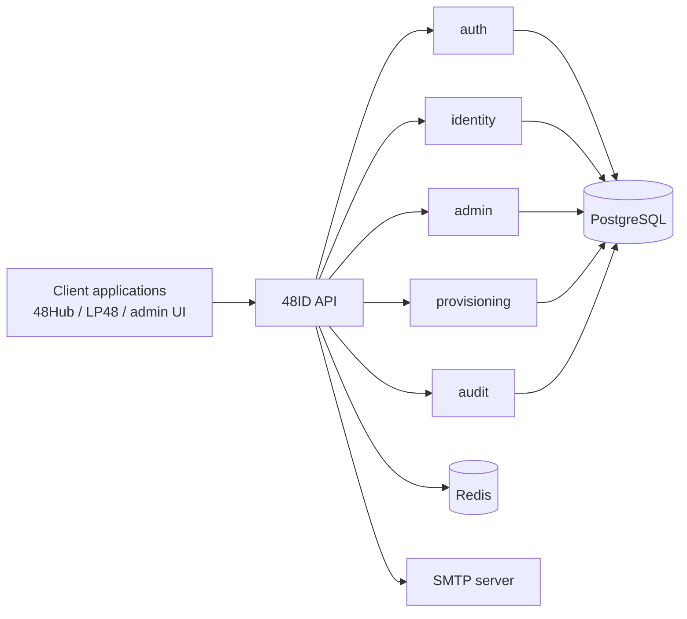

# 48ID

48ID is the centralized identity and authentication platform for the K48 ecosystem. It provides a single backend for user authentication, token issuance, user provisioning, profile management, auditability, and application-to-application token verification.

This repository documents and implements the **MVP scope** of 48ID.

## Purpose

48ID exists to give K48 applications a shared identity layer instead of duplicating authentication logic in each product. In the MVP, it supports:

- student and admin authentication with JWT access tokens and refresh tokens
- first-time account activation for provisioned users
- password reset and password change flows
- profile self-service for authenticated users
- admin user management and audit-log access
- CSV-based bulk user provisioning
- API key management for trusted backend integrations
- public key discovery through JWKS for JWT validation

## MVP features

- JWT-based sign-in, refresh, logout, and token verification
- account activation with email token
- forced password change after initial provisioning
- role-based authorization for `ADMIN` and `STUDENT`
- API-key-protected verification and public identity endpoints for trusted applications
- admin operations for user lifecycle, audit review, and API key rotation
- PostgreSQL persistence, Flyway migrations, Redis-backed supporting infrastructure, and OpenAPI UI

## Architecture overview

48ID is a Spring Boot 3 application organized with Spring Modulith into bounded modules:

- `auth` — login, JWT, refresh tokens, password reset, activation, API key verification
- `identity` — user aggregate, profile updates, roles, status transitions
- `admin` — privileged user administration and API key administration
- `provisioning` — CSV import workflow for bulk onboarding
- `audit` — audit event capture and retrieval
- `shared` — security, rate limiting, exception handling, infrastructure configuration



See the full documentation in [`docs/README.md`](docs/README.md).

## Quick start

### Prerequisites

- Java 21
- Docker and Docker Compose
- an SMTP server for email delivery in non-local environments

### Start dependencies

```bash
docker compose up -d postgres redis
```

### Configure environment

Copy the example environment file and adjust values as needed:

```bash
cp .env.example .env
```

Key variables:

- `DATABASE_URL`, `DATABASE_USERNAME`, `DATABASE_PASSWORD`
- `REDIS_HOST`, `REDIS_PORT`
- `JWT_ISSUER`, `JWT_RSA_PUBLIC_KEY`, `JWT_RSA_PRIVATE_KEY`
- `MAIL_HOST`, `MAIL_PORT`, `MAIL_FROM`
- `MAIL_LOGIN_URL`, `MAIL_ACTIVATION_URL`, `MAIL_RESET_PASSWORD_URL`

### Run the application

```bash
./gradlew bootRun
```

Windows:

```powershell
.\gradlew.bat bootRun
```

### Useful URLs

- API base URL: `http://localhost:8080/api/v1`
- Swagger UI: `http://localhost:8080/api/v1/docs`
- OpenAPI JSON: `http://localhost:8080/api-docs`
- JWKS: `http://localhost:8080/.well-known/jwks.json`

## Technology stack

- Java 21
- Spring Boot 3
- Spring Security
- Spring Modulith
- Spring Data JPA
- PostgreSQL
- Redis
- Flyway
- Bucket4j
- Springdoc OpenAPI
- JUnit 5, Spring Test, Testcontainers

## Integrating with the API

Typical integration patterns are:

1. **User-facing applications** authenticate users with `POST /api/v1/auth/login` and send the returned bearer token on protected requests.
2. **Trusted backend applications** use admin-created API keys in the `X-API-Key` header to call:
   - `POST /api/v1/auth/verify-token`
   - `GET /api/v1/users/{id}/identity`
   - `GET /api/v1/users/{matricule}/exists`
3. **JWT consumers** validate access tokens using the JWKS endpoint.

Start with:

- [`docs/overview/quickstart.md`](docs/overview/quickstart.md)
- [`docs/integration-guides/getting-started.md`](docs/integration-guides/getting-started.md)
- [`docs/api/overview.md`](docs/api/overview.md)

## Documentation

The complete documentation set is available under [`docs/`](docs/README.md), including:

- architecture
- API reference
- authentication and security flows
- admin operations
- deployment and testing guidance
- glossary

## Contributing

See [`CONTRIBUTING.md`](CONTRIBUTING.md) and [`docs/developer-guide/contributing.md`](docs/developer-guide/contributing.md).

## License

This project is licensed under the terms of the [MIT License](LICENSE).
