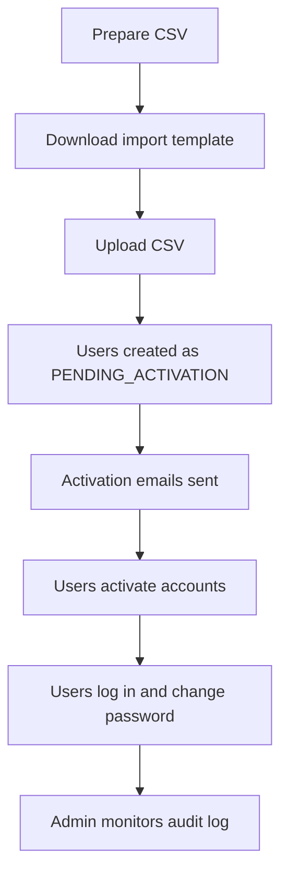

# Admin operations guide

## Scope

Admin operations cover the privileged workflows required to operate the MVP safely:

- review users
- change role and status
- unlock accounts
- reset passwords on behalf of users
- provision users from CSV
- access audit logs and login history
- manage API keys for trusted applications

## Recommended admin workflow

## CSV provisioning rules

The import template requires these columns:

- `matricule`
- `email`
- `name`
- `phone`
- `batch`
- `specialization`

Import behavior:

- invalid rows are reported with row-level errors
- duplicate matricules or emails are rejected
- successful rows create users in `PENDING_ACTIVATION`
- each successful row triggers an activation email

## User lifecycle controls

Administrators can:

- update profile data managed by the institution
- promote or demote roles
- suspend or reactivate a user
- unlock a locked account
- soft-delete an account
- trigger a password reset email

## Audit and traceability

Administrative actions should be reviewed through:

- full audit log queries
- login history per user

These endpoints are essential for support and accountability in the MVP.

## API key administration

API keys are intended for backend-to-backend trust, not browser applications. Recommended practice:

- create one key per application and environment
- store raw keys in a secure secret manager
- rotate keys periodically
- revoke keys immediately when compromised or no longer needed
