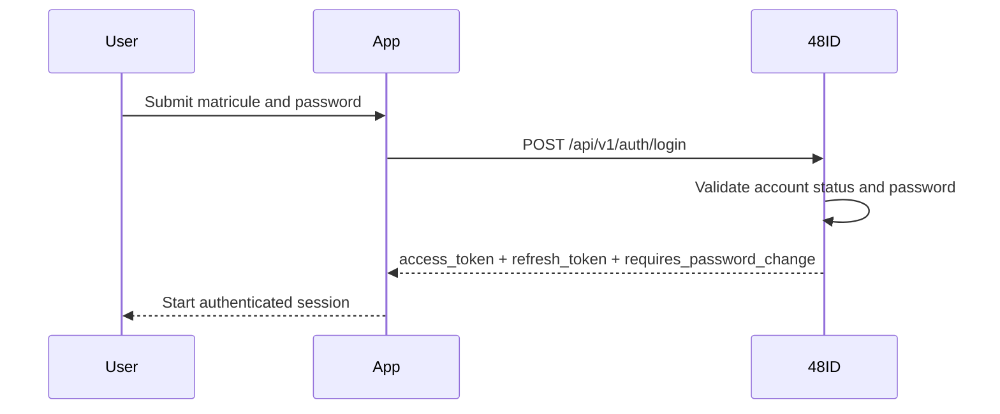
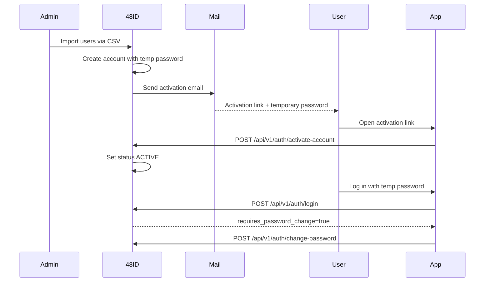
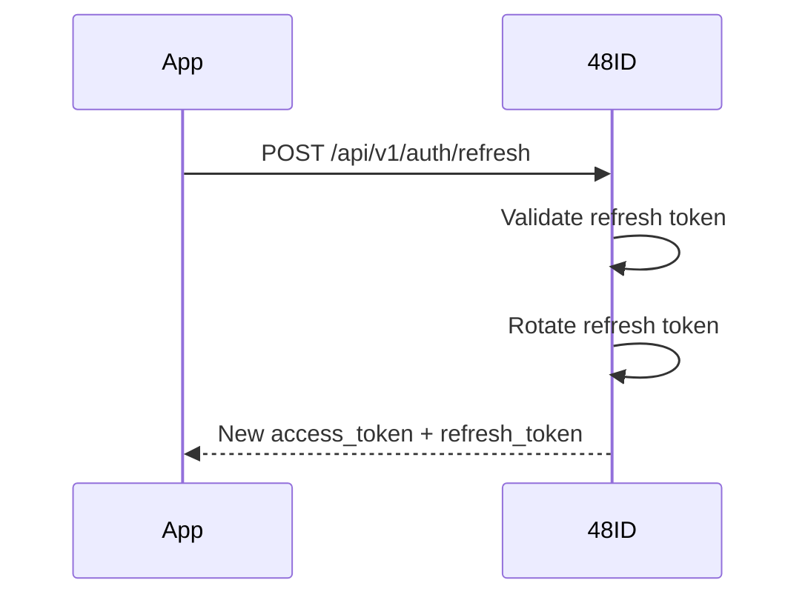
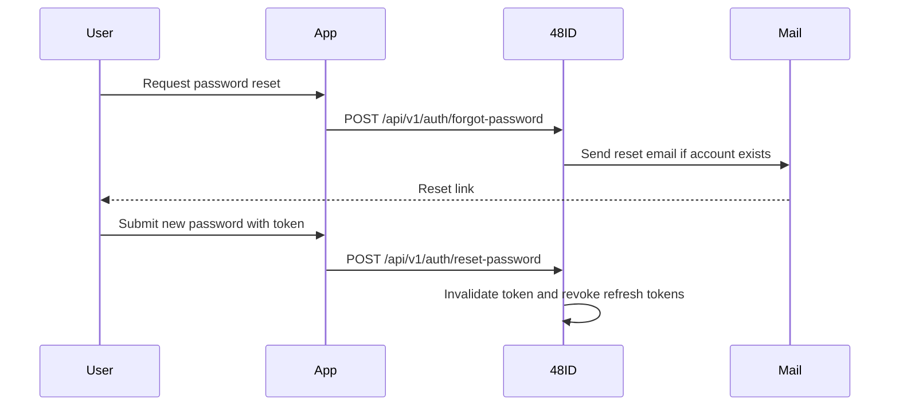

# Authentication flows

## Login flow

## Activation flow

Provisioned users are created in `PENDING_ACTIVATION` state. They cannot log in until activation succeeds.

## Refresh flow

## Password reset flow

## Session model

- access tokens are short-lived
- refresh tokens support session continuity
- logout revokes the supplied refresh token
- password reset revokes all refresh tokens for the user

## Password policy

The password policy is enforced server-side. The implementation validates password quality before change and reset operations and returns structured validation errors on failure.
