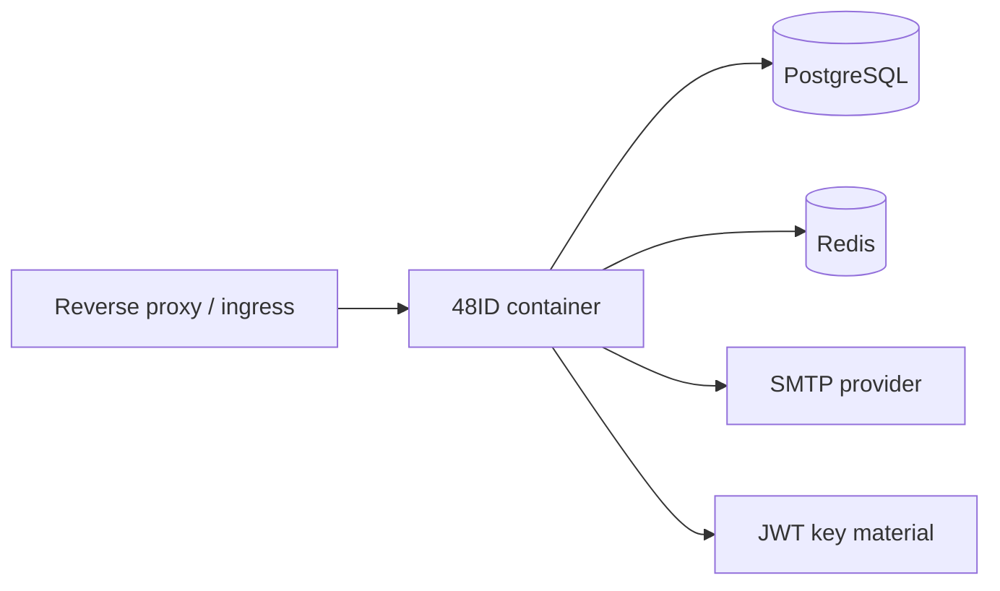

# Deployment guide

## Runtime components

A production deployment requires:

- the 48ID application container
- PostgreSQL
- Redis
- SMTP provider
- RSA key material for JWT signing

## Container build

The repository includes a multi-stage Dockerfile:

1. build stage on Eclipse Temurin JDK 21
2. runtime stage on Eclipse Temurin JRE 21

Build example:

```bash
docker build -t 48id:local .
```

## Local infrastructure with Docker Compose

`docker-compose.yml` provisions:

- PostgreSQL 17
- Redis 7.4

Start local dependencies:

```bash
docker compose up -d
```

## Required environment variables

### Database

- `DATABASE_URL`
- `DATABASE_USERNAME`
- `DATABASE_PASSWORD`

### Redis

- `REDIS_HOST`
- `REDIS_PORT`
- `REDIS_PASSWORD`

### Mail

- `MAIL_HOST`
- `MAIL_PORT`
- `MAIL_USERNAME`
- `MAIL_PASSWORD`
- `MAIL_SMTP_AUTH`
- `MAIL_SMTP_STARTTLS`
- `MAIL_FROM`
- `MAIL_LOGIN_URL`
- `MAIL_ACTIVATION_URL`
- `MAIL_RESET_PASSWORD_URL`

### JWT

- `JWT_ISSUER`
- `JWT_ACCESS_TOKEN_EXPIRY`
- `JWT_REFRESH_TOKEN_EXPIRY`
- `JWT_RSA_PUBLIC_KEY`
- `JWT_RSA_PRIVATE_KEY`

### Platform

- `API_PREFIX`
- `CORS_ALLOWED_ORIGINS`
- `SERVER_PORT`
- `OPENAPI_SERVERS`
- `SPRINGDOC_SWAGGER_ENABLED`

## Deployment topology



## Production recommendations

- run behind HTTPS termination
- store secrets in a managed secret store
- back up PostgreSQL and protect key material
- restrict Swagger UI exposure if needed
- centralize logs for audit and incident response
- prefer managed PostgreSQL and Redis in production

## CI/CD

The GitHub Actions workflow:

- checks out the repository
- installs JDK 21
- starts PostgreSQL and Redis services
- runs `./gradlew build`

This validates compilation and tests on push and pull request events.
