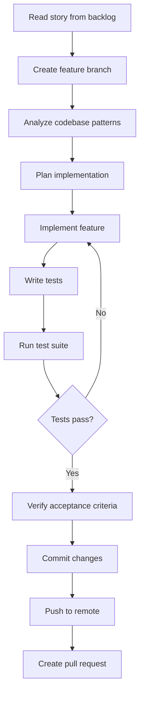

# Story implementation workflow

This guide describes the complete workflow for implementing user stories from the MVP backlog.

## Prerequisites

- Git configured and authenticated
- Java 21 installed
- Gradle wrapper available (`./gradlew` or `gradlew.bat`)
- IDE or editor of choice
- Docker Desktop running (PostgreSQL on port `5433`, Redis on `6379` via `docker compose up -d db redis`)

## Workflow overview



---

## Step 1: Read and understand the story

### Location

`MVP/48id agile backlog mvp.md`

### Extract from the story

- **Story ID** (e.g., `48ID-E06-02`)
- **Title and description**
- **Acceptance criteria** (GHERKIN scenarios)
- **Artefacts** (files to create/modify)
- **Wireframe** (if applicable)

### Output

Write a summary:
- What the feature must achieve
- All acceptance criteria that must be met
- Which files need to be created or modified

---

## Step 2: Create feature branch

```bash
cd 48id

# Switch to main and pull latest
git checkout main
git pull origin main

# Create feature branch
git checkout -b feature/48ID-<STORY-ID>-<short-description>
```

### Branch naming convention

`feature/48ID-<EPIC>-<SEQUENCE>-<short-description>`

- Use lowercase
- Separate words with hyphens
- Keep description under 5 words

**Examples:**
- `feature/48ID-E06-02-activation-email-template`
- `feature/48ID-E13-01-openapi-docs`

---

## Step 3: Analyze existing codebase

Explore the project to understand:
- Existing patterns and conventions
- Similar features already implemented
- Module structure (Spring Modulith boundaries)
- Test patterns used

### Key directories

- `src/main/java/io/k48/fortyeightid/` — main source
- `src/test/java/io/k48/fortyeightid/` — tests
- `src/main/resources/` — configuration, templates, migrations

### Look for

- Similar controllers/services to copy patterns from
- Existing test structures
- Naming conventions
- How similar requirements are handled

---

## Step 4: Implementation plan

Write down:

1. Which files will you **create**?
2. Which files will you **modify**?
3. What new methods/classes are needed?
4. What tests will you write?
5. Are there dependencies to add to `build.gradle`?

**Example:**

```text
Create:
  - src/main/resources/templates/activation-email.html
  - src/test/java/io/k48/fortyeightid/auth/internal/EmailServiceTest.java

Modify:
  - src/main/java/io/k48/fortyeightid/auth/internal/EmailService.java
  - src/main/resources/application.properties
  - docs/api/authentication.md
```

---

## Step 5: Implement the feature

### Implementation order

1. **Service layer** (business logic)
2. **Controller** (HTTP endpoints)
3. **Configuration** (if needed)
4. **Templates/resources** (if needed)

### Follow Spring Modulith architecture

- Each module is self-contained
- Use ports for cross-module communication
- Respect module boundaries (validated by `ApplicationModularityTests`)

### Package structure

```text
io.k48.fortyeightid
├── admin/          — admin endpoints and services
├── auth/           — authentication, JWT, activation, password reset
├── identity/       — user entity and profile
├── provisioning/   — CSV import and user creation
├── audit/          — audit logging
└── shared/         — common utilities, exceptions, config
```

### Naming conventions

- **Classes:** `PascalCase` (e.g., `CsvImportService`)
- **Methods:** `camelCase` (e.g., `importUsers`)
- **Tests:** `method_shouldDoSomething` (e.g., `importUsers_successfullyImportsAllValidRows`)
- **Exceptions:** `SpecificException` (e.g., `DuplicateMatriculeException`)

### Response patterns

```java
// Success
return ResponseEntity.ok(data);

// Created
return ResponseEntity.status(HttpStatus.CREATED).body(data);

// No content
return ResponseEntity.noContent().build();

// Bad request
throw new ValidationException("message");  // handled by GlobalExceptionHandler
```

### Security

- Admin endpoints: `@PreAuthorize("hasRole('ADMIN')")`
- Student endpoints: extract user ID from JWT principal, never from request
- API key endpoints: `@PreAuthorize("hasRole('API_CLIENT')")`
- Never log sensitive data (passwords, tokens)

### Error handling

- Use custom exceptions (e.g., `UserNotFoundException`)
- Let `GlobalExceptionHandler` convert to Problem Details
- Log errors at `ERROR` level with context

---

## Step 6: Write tests

### Test pattern (unit tests)

```java
@ExtendWith(MockitoExtension.class)
class YourServiceTest {

    @Mock
    private DependencyPort dependencyPort;

    @InjectMocks
    private YourService yourService;

    @Test
    void method_shouldDoSomething() {
        // Given
        when(dependencyPort.doSomething()).thenReturn(result);

        // When
        var result = yourService.method();

        // Then
        assertThat(result).isEqualTo(expected);
    }
}
```

### Controller tests

```java
@ExtendWith(MockitoExtension.class)
class YourControllerTest {

    @Mock
    private YourService yourService;

    @InjectMocks
    private YourController yourController;

    @Test
    void endpoint_returnsCorrectResponse() {
        // Given
        when(yourService.method()).thenReturn(data);

        // When
        var response = yourController.endpoint();

        // Then
        assertThat(response.getStatusCode().value()).isEqualTo(200);
        assertThat(response.getBody()).isEqualTo(expected);
    }
}
```

### Test requirements

- Test all acceptance criteria
- Test error cases
- Test edge cases
- Aim for 80%+ code coverage on new code

---

## Step 7: Run tests

```bash
cd 48id

# Run all tests
./gradlew clean test

# Windows
.\gradlew.bat clean test

# Run specific test class
./gradlew test --tests "io.k48.fortyeightid.yourpackage.YourTestClass"
```

### Expected output

```text
BUILD SUCCESSFUL
XX tests completed, 0 failures
```

### If tests fail

1. Read the full error message and stack trace
2. Fix the failing test or implementation
3. Re-run tests until all pass

---

## Step 8: Verify acceptance criteria

Create a checklist:

| Criterion | Status | Evidence |
|-----------|--------|----------|
| AC 1: User receives activation email | ✅ | `EmailServiceTest.sendActivationEmail_sendsHtmlEmailWithTemplate` |
| AC 2: Email contains activation link | ✅ | Manual verification of template |
| AC 3: ... | ✅ | ... |

**All criteria must be ✅ before proceeding.**

---

## Step 9: Update documentation

If your change affects:

- **API endpoints** → update `docs/api/*.md`
- **Environment variables** → update `docs/guide/deployment.md`, `docs/guide/environment-setup.md`, and `.env.example`
- **Authentication/security** → update `docs/guide/authentication.md` and `docs/guide/architecture.md`
- **Database migrations** → add inline SQL comments
- **Architecture** → update `docs/guide/architecture.md`
- **Integration patterns** → update `docs/guide/integration.md`

See the [PR checklist template](../../.github/pull_request_template.md) for full guidance.

---

## Step 10: Commit changes

```bash
cd 48id

# Check status
git status

# Add changed files
git add <file1> <file2> <file3>

# Or add all changes
git add .

# Commit with clear message
git commit -m "feat: short description (48ID-EXX-XX)"
```

### Commit message format

```text
feat: add CSV import template endpoint (48ID-E06-03)
```

### Commit types

- `feat:` — new feature
- `fix:` — bug fix
- `refactor:` — code refactoring
- `test:` — test additions
- `docs:` — documentation changes
- `chore:` — build, CI, or tooling changes

---

## Step 11: Push to remote

```bash
# Push branch and set upstream
git push -u origin feature/48ID-<STORY-ID>-<short-description>
```

**Example:**

```bash
git push -u origin feature/48ID-E06-03-csv-import-template
```

---

## Step 12: Create pull request

### PR title

```text
feat: description (48ID-E06-XX)
```

### PR description template

```markdown
## Overview

Implements **Story 48ID-E06-03** from the MVP backlog: [Story Title].

[Brief description of what the feature does]

## Changes

**Modified Files:**
- `path/to/file1.java` — Description of change
- `path/to/file2.java` — Description of change
- `path/to/file3.java` — New file for tests

## Acceptance Criteria

| Criterion | Status |
|-----------|--------|
| [AC 1 description] | ✅ |
| [AC 2 description] | ✅ |
| [AC 3 description] | ✅ |

## Test Results

- `[Test Class Name]`: X tests, 0 failures
- All project tests: XX tests, 0 failures

## Usage

[How to use/test the feature]

\`\`\`bash
curl example or usage instructions
\`\`\`

## Related

- **Epic:** E06 — CSV Account Provisioning
- **Previous:** 48ID-E06-02 — [Previous Story Title]
- **Next:** 48ID-E06-04 — [Next Story Title]
```

---

## Troubleshooting

### Compilation errors

1. Check imports are correct
2. Verify class names match exactly
3. Ensure all dependencies are in `build.gradle`
4. Run `./gradlew clean build` to force recompilation

### Test failures

1. Read the full stack trace
2. Check mock setups are correct
3. Verify expected values match actual values
4. Re-run with `--info` for more details:
   ```bash
   ./gradlew test --tests "YourTest" --info
   ```

### Git issues

1. If commit message fails, use `-m` with escaped quotes
2. If push fails, pull first: `git pull --rebase origin main`
3. If branch exists, add unique suffix to branch name

---

## After completing a story

1. Verify PR is created on GitHub
2. Wait for code review
3. Address review feedback if needed
4. Return to **Step 1** for the next story in sequence
5. Stories should be implemented in chronological order from the backlog

---

## Quick reference

### File locations

- **Backlog:** `MVP/48id agile backlog mvp.md`
- **Architecture:** `MVP/48ID_Architecture_v2_SpringBoot.docx.md`
- **Main code:** `48id/src/main/java/io/k48/fortyeightid/`
- **Tests:** `48id/src/test/java/io/k48/fortyeightid/`
- **Migrations:** `48id/src/main/resources/db/migration/`
- **Templates:** `48id/src/main/resources/templates/`
- **Docs:** `48id/docs/`
- **Dev profile config:** `48id/src/main/resources/application-dev.properties`

### Common commands

```bash
# Build and test
./gradlew clean build

# Run tests
./gradlew test

# Run specific test
./gradlew test --tests "ClassName"

# Check code coverage
./gradlew jacocoTestReport

# Run application locally
./gradlew bootRun
```
