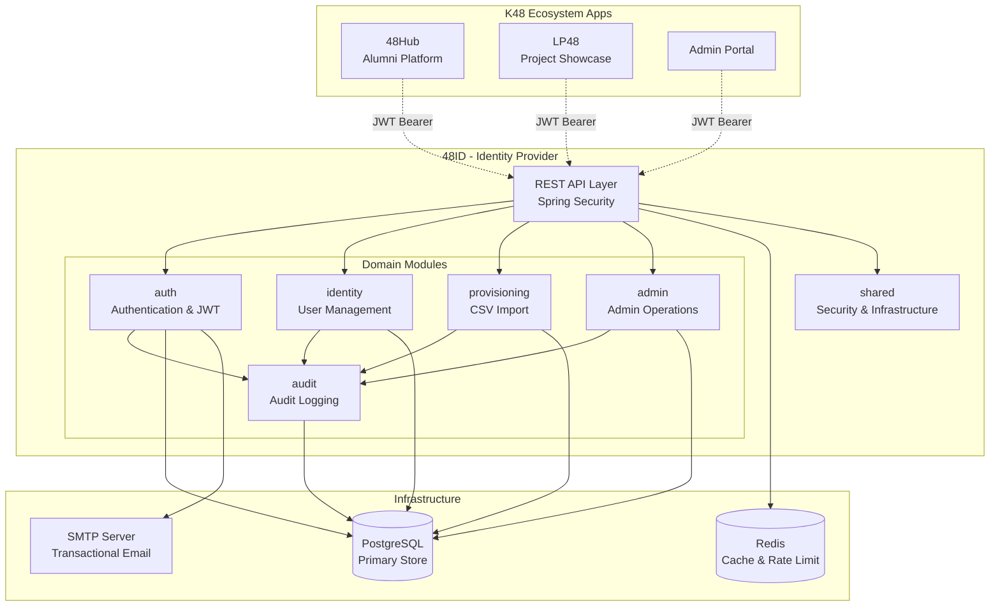
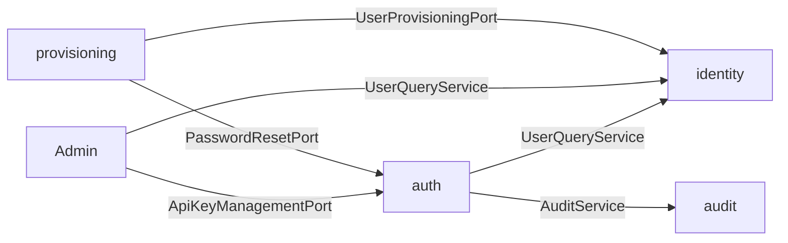
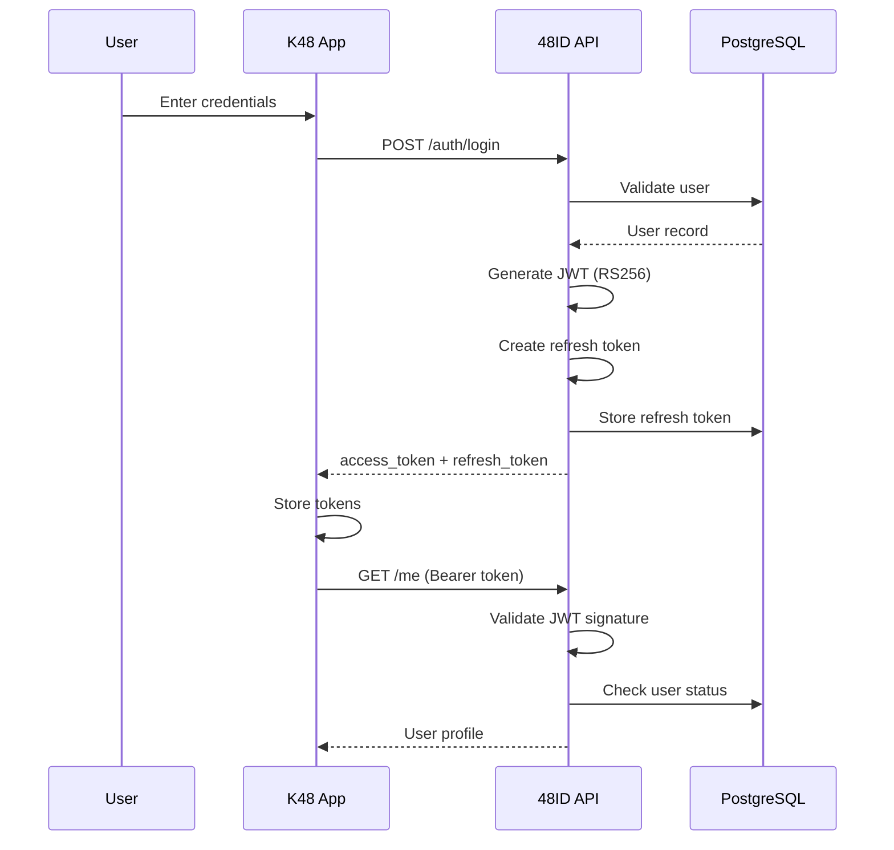
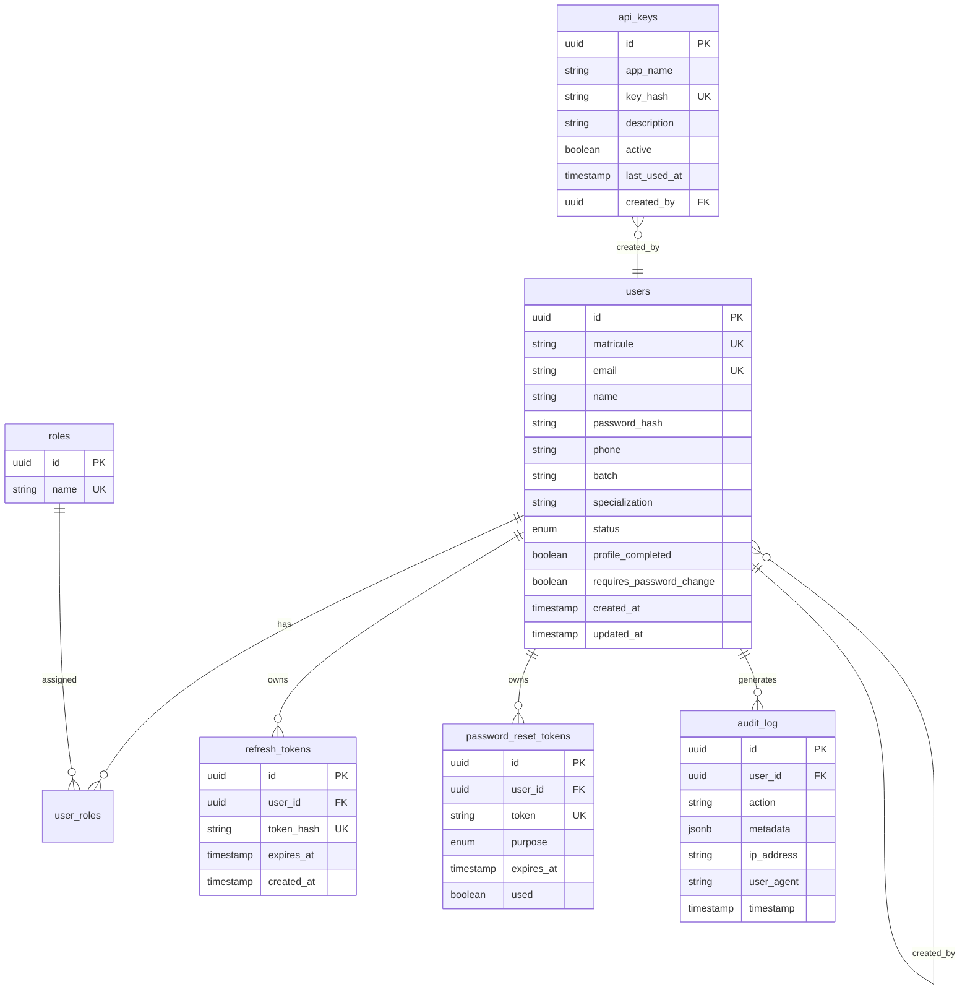
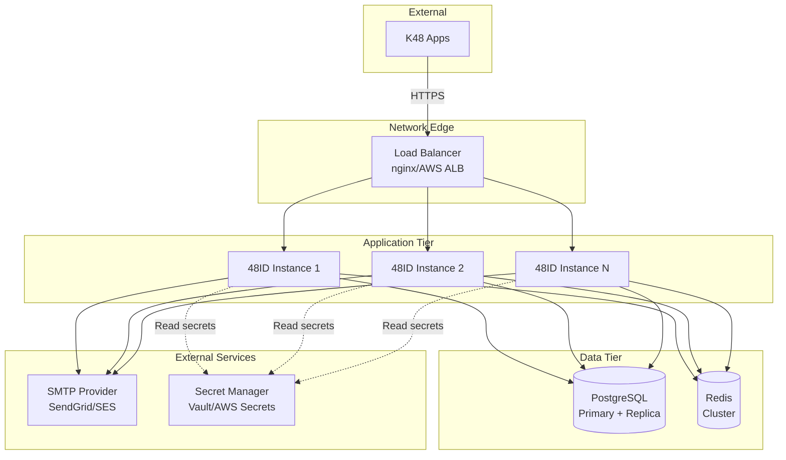

# Architecture

## System Overview

48ID is the centralized identity provider for the K48 ecosystem, built with **Spring Boot 3** and **Spring Modulith** for clean, maintainable architecture.



## Spring Modulith Architecture

48ID uses **Spring Modulith** to enforce module boundaries at compile-time and runtime.

### Module Structure

```
io.k48.fortyeightid/
├── auth/                    # Authentication module
│   ├── internal/           # Private implementation
│   ├── ports/              # Public interfaces
│   └── package-info.java   # Module metadata
├── identity/                # Identity management module
│   ├── internal/
│   └── package-info.java
├── admin/                   # Admin operations module
│   ├── internal/
│   └── package-info.java
├── provisioning/            # User provisioning module
│   ├── internal/
│   └── package-info.java
├── audit/                   # Audit logging module
│   ├── internal/
│   └── package-info.java
└── shared/                  # Shared infrastructure
    ├── config/
    ├── exception/
    └── package-info.java
```

### Module Responsibilities

| Module | Responsibility | Public Interfaces |
|--------|----------------|-------------------|
| **auth** | Authentication, JWT, password flows, activation, API keys | `PasswordResetPort`, `EmailPort`, `ApiKeyManagementPort` |
| **identity** | User entity, profiles, roles, status management | `UserQueryService`, `UserProvisioningPort`, `UserRoleService` |
| **admin** | Privileged user operations, API key admin, audit access | Admin controllers |
| **provisioning** | CSV import, bulk user creation with activation | Provisioning controllers |
| **audit** | Audit event persistence and querying | `AuditService` |
| **shared** | Security config, rate limiting, error handling | Global exception handler, security filters |

### Module Communication

Modules communicate through **public ports** (interfaces) to maintain loose coupling:



**Rules:**
- ✅ Modules can call public ports from other modules
- ❌ Modules cannot access `internal/` packages of other modules
- ❌ No circular dependencies between modules
- ✅ Validated at build time by `ApplicationModularityTests`

## Authentication Architecture

### JWT Token Flow



### Token Types

| Token | Lifetime | Purpose | Storage |
|-------|----------|---------|---------|
| **Access Token** | 15 minutes | API authentication | Memory (not localStorage) |
| **Refresh Token** | 86400 seconds (1 day) | Get new access token | HttpOnly cookie recommended |
| **Activation Token** | 24 hours | Account activation | Email link only |
| **Reset Token** | 1 hour | Password reset | Email link only |
| **API Key** | No expiration | Server-to-server auth | Environment variables |

### Security Features

- **RS256 signatures** — Asymmetric JWT signing
- **Refresh token rotation** — New refresh token on each use
- **Token revocation** — Refresh tokens can be revoked
- **Rate limiting** — 5 login attempts per 15 min per matricule
- **Password policies** — Minimum length, complexity requirements
- **Audit logging** — All auth events logged

## Database Architecture

### Entity Model



### Schema Evolution

Database schema is managed with **Flyway** versioned migrations:

```
src/main/resources/db/migration/
├── V1__baseline.sql
├── V2__api_keys.sql
├── V3__api_keys_add_description_and_last_used.sql
├── V4__add_requires_password_change_column.sql
├── V5__add_created_by_to_api_keys.sql
├── V6__add_user_agent_to_audit_log.sql
└── V7__add_purpose_to_password_reset_tokens.sql
```

Migrations run automatically on application startup.

## Infrastructure Components

### PostgreSQL
- **Purpose:** Primary data store
- **Version:** 17+
- **Features used:** UUIDs, JSONB, indexes, constraints

### Redis
- **Purpose:** Rate limiting, session support
- **Version:** 7.4+
- **Use cases:** Bucket4j rate limit state

### SMTP
- **Purpose:** Transactional emails
- **Use cases:** Account activation, password reset

### Springdoc OpenAPI
- **Purpose:** Interactive API documentation
- **Access:** `/api/v1/docs` (Swagger UI)

## Deployment Architecture

### Recommended Production Topology



### Horizontal Scaling

48ID is **stateless** and can scale horizontally:
- ✅ Multiple instances behind a load balancer
- ✅ Shared PostgreSQL and Redis
- ✅ No in-memory session state
- ✅ JWTs are self-contained and validated independently

## Security Model

### Defense in Depth

```mermaid
graph TD
    A[HTTPS/TLS] --> B[Rate Limiting]
    B --> C[JWT Validation]
    C --> D[Role-Based Access Control]
    D --> E[Audit Logging]
    
    A1[Network Edge] -.-> A
    B1[Bucket4j + Redis] -.-> B
    C1[RS256 Signature] -.-> C
    D1[@PreAuthorize] -.-> D
    E1[PostgreSQL] -.-> E
```

**Layers:**
1. **Transport:** HTTPS/TLS in production
2. **Rate limiting:** Per-IP and per-user limits
3. **Authentication:** JWT signature validation
4. **Authorization:** Role-based access control
5. **Audit:** Complete event trail

### Threat Model

| Threat | Mitigation |
|--------|------------|
| Credential stuffing | Rate limiting on `/auth/login` |
| Token theft | Short-lived access tokens, refresh token rotation |
| SQL injection | JPA parameterized queries |
| XSS | JSON responses, no HTML rendering |
| CSRF | Stateless API, no cookies for auth |
| Enumeration | Generic error messages, email enumeration protection |

## Performance Considerations

### Caching Strategy
- ✅ JWT validation is signature-based (no DB lookup per request)
- ✅ JWKS cached by clients
- ⚠️ User lookups hit database (consider caching for high-traffic apps)

### Database Optimization
- ✅ Indexed columns: `matricule`, `email`, `token`
- ✅ Connection pooling with HikariCP
- ✅ Prepared statement caching

### Monitoring Points
- Request rate and latency
- Database connection pool utilization
- Redis connection health
- JWT validation failures
- Rate limit hits
- Audit log volume

## Testing Strategy

The architecture is validated by different test layers:

| Test Type | Coverage | Tools |
|-----------|----------|-------|
| **Unit Tests** | Business logic, services | JUnit 5, Mockito |
| **Module Tests** | Module boundaries | Spring Modulith |
| **Integration Tests** | End-to-end flows | Spring Boot Test, Testcontainers |
| **Contract Tests** | API contracts | Spring MockMvc |

**Key test:** `ApplicationModularityTests` enforces that module boundaries are respected.

## Next Steps

- **[Authentication Guide](authentication.md)** — Deep dive into auth flows
- **[Integration Guide](integration.md)** — How to integrate your app
- **[Deployment Guide](deployment.md)** — Deploy to production
- **[API Reference](../api/overview.md)** — Complete API documentation
