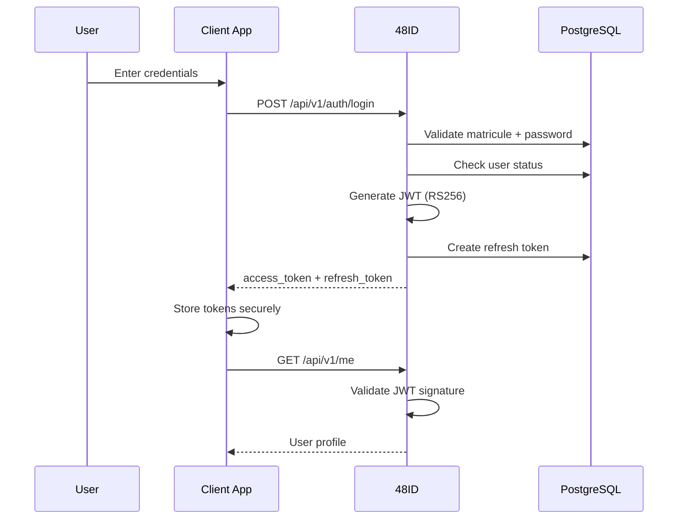
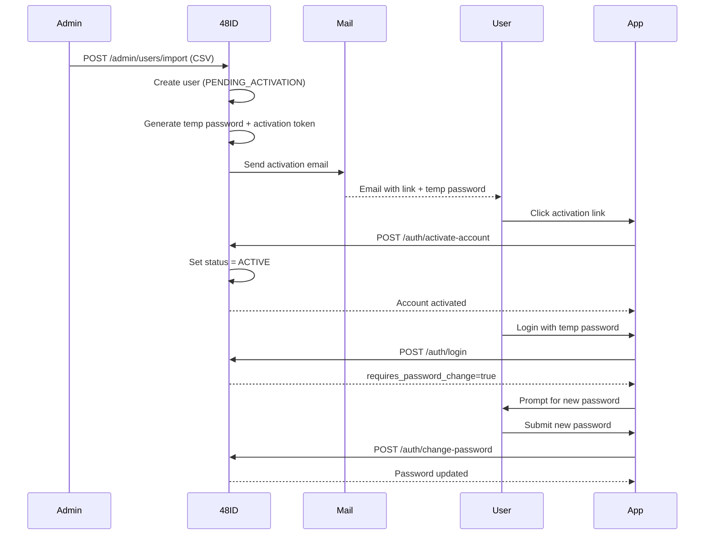
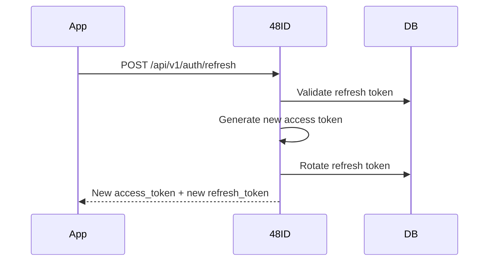
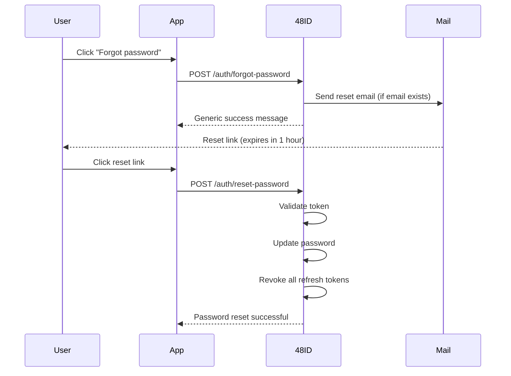

# Authentication

This guide explains how authentication works in 48ID.

## Overview

48ID uses **JWT (JSON Web Tokens)** with RS256 asymmetric signing for authentication. The system supports:

- User authentication with access and refresh tokens
- Account activation for provisioned users
- Password reset and change flows
- API key authentication for server-to-server communication

## Authentication Flows

### 1. Login Flow



**Request:**
```bash
POST /api/v1/auth/login
Content-Type: application/json

{
  "matricule": "K48-2024-001",
  "password": "userPassword"
}
```

**Response:**
```json
{
  "access_token": "eyJhbGciOiJSUzI1NiIsInR5cCI6IkpXVCJ9...",
  "refresh_token": "550e8400-e29b-41d4-a716-446655440000",
  "token_type": "Bearer",
  "expires_in": 900,
  "requires_password_change": false,
  "user": {
    "id": "...",
    "matricule": "K48-2024-001",
    "name": "Ama Owusu",
    "role": "STUDENT",
    "batch": "2024",
    "specialization": "Software Engineering"
  }
}
```

### 2. Account Activation Flow

New users are provisioned as `PENDING_ACTIVATION` and must activate their account before logging in.



**Activation request:**
```bash
POST /api/v1/auth/activate-account
Content-Type: application/json

{
  "token": "activation-token-from-email"
}
```

**Response:**
```json
{
  "message": "Account activated successfully. You can now log in with your temporary password and change it on first login."
}
```

### 3. Refresh Token Flow

Access tokens expire after 15 minutes. Use refresh tokens to get new access tokens without re-authenticating.



**Request:**
```bash
POST /api/v1/auth/refresh
Content-Type: application/json

{
  "refresh_token": "550e8400-e29b-41d4-a716-446655440000"
}
```

**Response:**
```json
{
  "access_token": "eyJhbGciOiJSUzI1NiIsInR5cCI6IkpXVCJ9...",
  "refresh_token": "660e8400-e29b-41d4-a716-446655440000",
  "token_type": "Bearer",
  "expires_in": 900
}
```

### 4. Password Reset Flow

Users can request a password reset if they forget their password.



**Forgot password request:**
```bash
POST /api/v1/auth/forgot-password
Content-Type: application/json

{
  "email": "user@k48.io"
}
```

**Response (always 200 to prevent email enumeration):**
```json
{
  "message": "If this email is registered, a password reset link has been sent."
}
```

**Reset password request:**
```bash
POST /api/v1/auth/reset-password
Content-Type: application/json

{
  "token": "reset-token-from-email",
  "newPassword": "NewSecure@2026"
}
```

### 5. Password Change Flow

Authenticated users can change their password.

```bash
POST /api/v1/auth/change-password
Authorization: Bearer {access_token}
Content-Type: application/json

{
  "currentPassword": "OldPassword123",
  "newPassword": "NewSecure@2026"
}
```

## Token Details

### Access Token (JWT)

**Format:** RS256-signed JWT

**Claims:**
```json
{
  "sub": "user-uuid",
  "matricule": "K48-2024-001",
  "name": "Ama Owusu",
  "role": "STUDENT",
  "batch": "2024",
  "iss": "http://localhost:8080",
  "iat": 1710259200,
  "exp": 1710260100
}
```

**Lifetime:** 15 minutes  
**Storage:** Memory (not localStorage)  
**Usage:** `Authorization: Bearer {token}` header

### Refresh Token

**Format:** UUID v4  
**Lifetime:** 86400 seconds (1 day)  
**Storage:** HttpOnly cookie (recommended) or secure storage  
**Usage:** POST to `/auth/refresh` to get new access token  
**Security:** Rotated on each use

### Activation Token

**Format:** UUID v4  
**Lifetime:** 24 hours  
**Storage:** Email link only  
**Usage:** POST to `/auth/activate-account`  
**Security:** Single-use, deleted after activation

### Reset Token

**Format:** UUID v4  
**Lifetime:** 1 hour  
**Storage:** Email link only  
**Usage:** POST to `/auth/reset-password`  
**Security:** Single-use, all refresh tokens revoked on use

## API Key Authentication

For **server-to-server** communication, use API keys instead of JWT.

**Usage:**
```bash
curl -X POST http://localhost:8080/api/v1/auth/verify-token \
  -H "X-API-Key: your-api-key" \
  -H "Content-Type: application/json" \
  -d '{"token":"user-jwt-token"}'
```

**Endpoints requiring API key:**
- `POST /api/v1/auth/verify-token`
- `GET /api/v1/users/{id}/identity`
- `GET /api/v1/users/{matricule}/exists`

See [Integration Guide](integration.md) for details.

## Authorization Model

### Roles

| Role | Description | Permissions |
|------|-------------|-------------|
| **STUDENT** | End user | Authenticate, view/update own profile, change password |
| **ADMIN** | Administrator | All student permissions + user management, audit access, API keys |
| **API_CLIENT** | Trusted application | Verify tokens, query public identity |

### User Status

| Status | Can Login? | Description |
|--------|------------|-------------|
| **ACTIVE** | ✅ Yes | Normal operational state |
| **PENDING_ACTIVATION** | ❌ No | Awaiting account activation |
| **SUSPENDED** | ❌ No | Administratively disabled |

## Security Features

### Password Policy

Enforced server-side:
- Minimum length: 8 characters
- Complexity requirements validated
- No password reuse (current password check)

### Rate Limiting

| Endpoint | Limit |
|----------|-------|
| `/auth/login` | 5 attempts per 15 minutes per matricule |
| `/auth/forgot-password` | 3 requests per hour per email/IP |
| Global (per IP) | 100 requests per minute |

### Audit Logging

All authentication events are logged:
- Login success/failure
- Password changes
- Account activations
- Password resets
- Token refreshes

See [Admin Guide](../api/admin.md) for audit log access.

## JWKS (JSON Web Key Set)

48ID publishes its public keys at:

```
GET /.well-known/jwks.json
```

**Response:**
```json
{
  "keys": [
    {
      "kty": "RSA",
      "kid": "48id-2024",
      "use": "sig",
      "alg": "RS256",
      "n": "...",
      "e": "AQAB"
    }
  ]
}
```

Clients can use JWKS to **locally validate** JWT signatures without calling 48ID.

**Libraries:**
- Node.js: [jose](https://github.com/panva/jose)
- Python: [python-jose](https://github.com/mpdavis/python-jose)
- Java: [nimbus-jose-jwt](https://connect2id.com/products/nimbus-jose-jwt)

## Best Practices

### For Client Applications

✅ **DO:**
- Store access tokens in memory (not localStorage)
- Use HttpOnly cookies for refresh tokens
- Validate JWT signature using JWKS
- Handle `requires_password_change=true` explicitly
- Implement token refresh before expiration

❌ **DON'T:**
- Store tokens in localStorage (XSS risk)
- Log tokens in console or error messages
- Send tokens over HTTP (use HTTPS)
- Ignore token expiration

### For Backend Services

✅ **DO:**
- Use API keys for server-to-server auth
- Store API keys in environment variables or secret managers
- Call `/auth/verify-token` to validate user tokens
- Check user status in the response

❌ **DON'T:**
- Share API keys across environments
- Commit API keys to source control
- Use user JWT tokens for server-to-server calls

## Troubleshooting

### "ACCOUNT_NOT_ACTIVATED"

**Cause:** User status is `PENDING_ACTIVATION`  
**Solution:** User must click activation link in email

### "TOKEN_EXPIRED"

**Cause:** Access token expired (15 min lifetime)  
**Solution:** Use refresh token to get new access token

### "REFRESH_TOKEN_INVALID"

**Cause:** Refresh token expired, revoked, or already used  
**Solution:** User must log in again

### "ACCOUNT_LOCKED"

**Cause:** Too many failed login attempts  
**Solution:** Wait 15 minutes or contact admin to unlock

### "PASSWORD_POLICY_VIOLATION"

**Cause:** New password doesn't meet requirements  
**Solution:** Use stronger password (min 8 chars, complexity)

## Next Steps

- **[Integration Guide](integration.md)** — Integrate your app with 48ID
- **[API Reference](../api/authentication.md)** — Complete auth endpoint docs
- **[Admin Guide](../api/admin.md)** — User management operations
