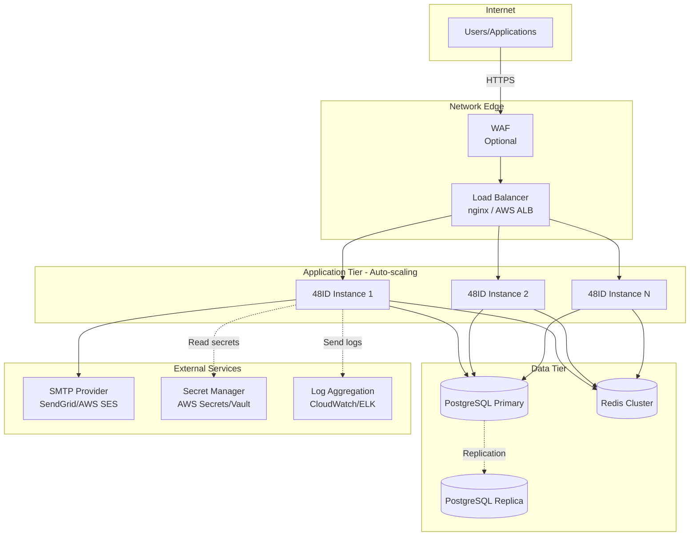

# Deployment Guide

This guide covers deploying 48ID to production environments.

## Production Architecture



## Prerequisites

- **Container orchestration** (Kubernetes, ECS, or Docker)
- **Managed PostgreSQL** (AWS RDS, Cloud SQL, etc.)
- **Managed Redis** (ElastiCache, Cloud Memorystore, etc.)
- **SMTP provider** (SendGrid, AWS SES, Mailgun)
- **Secret manager** (AWS Secrets Manager, HashiCorp Vault)
- **HTTPS/TLS** certificates

## Container Image

### Build Production Image

```bash
# Build the Docker image
docker build -t 48id:1.0.0 .

# Tag for your registry
docker tag 48id:1.0.0 your-registry/48id:1.0.0

# Push to registry
docker push your-registry/48id:1.0.0
```

### Multi-stage Dockerfile

The included `Dockerfile` uses multi-stage build:

```dockerfile
# Stage 1: Build
FROM eclipse-temurin:21-jdk AS build
WORKDIR /app
ARG BUILD_TIMESTAMP
RUN echo "Building at: $BUILD_TIMESTAMP"
COPY gradle/ gradle/
COPY gradlew build.gradle settings.gradle ./
RUN ./gradlew dependencies --no-daemon || true
COPY src/ src/
RUN ./gradlew clean bootJar --no-daemon -x test

# Stage 2: Runtime
FROM eclipse-temurin:21-jre
WORKDIR /app
COPY --from=build /app/build/libs/*.jar app.jar
EXPOSE 8080
ENTRYPOINT ["java", "-jar", "app.jar"]
```

## Environment Configuration

### Required Environment Variables

Create these in your secret manager:

#### Database
```env
DATABASE_URL=jdbc:postgresql://prod-db.example.com:5432/fortyeightid
DATABASE_USERNAME=fortyeightid_prod
DATABASE_PASSWORD=<strong-password>
```

#### Redis
```env
REDIS_HOST=prod-redis.example.com
REDIS_PORT=6379
REDIS_PASSWORD=<redis-password>
```

#### JWT
```env
JWT_ISSUER=https://id.k48.io
JWT_ACCESS_TOKEN_EXPIRY=900
JWT_REFRESH_TOKEN_EXPIRY=2592000
JWT_RSA_PUBLIC_KEY=<base64-encoded-public-key>
JWT_RSA_PRIVATE_KEY=<base64-encoded-private-key>
```

#### Mail
```env
MAIL_HOST=smtp.sendgrid.net
MAIL_PORT=587
MAIL_USERNAME=apikey
MAIL_PASSWORD=<sendgrid-api-key>
MAIL_SMTP_AUTH=true
MAIL_SMTP_STARTTLS=true
MAIL_FROM=no-reply@k48.io
MAIL_LOGIN_URL=https://app.k48.io/login
MAIL_ACTIVATION_URL=https://app.k48.io/activate
MAIL_RESET_PASSWORD_URL=https://app.k48.io/reset-password
```

#### Platform
```env
SERVER_PORT=8080
API_PREFIX=/api/v1
CORS_ALLOWED_ORIGINS=https://hub.k48.io,https://lp.k48.io
SPRINGDOC_SWAGGER_ENABLED=false
```

### Generate RSA Keys

```bash
# Generate private key
openssl genrsa -out private.pem 2048

# Extract public key
openssl rsa -in private.pem -pubout -out public.pem

# Base64 encode for environment variables
cat private.pem | base64 | tr -d '\n'
cat public.pem | base64 | tr -d '\n'
```

## Kubernetes Deployment

### Deployment Manifest

```yaml
apiVersion: apps/v1
kind: Deployment
metadata:
  name: 48id
  namespace: k48-platform
spec:
  replicas: 3
  selector:
    matchLabels:
      app: 48id
  template:
    metadata:
      labels:
        app: 48id
    spec:
      containers:
      - name: 48id
        image: your-registry/48id:1.0.0
        ports:
        - containerPort: 8080
          name: http
        env:
        - name: DATABASE_URL
          valueFrom:
            secretKeyRef:
              name: 48id-secrets
              key: database-url
        - name: DATABASE_USERNAME
          valueFrom:
            secretKeyRef:
              name: 48id-secrets
              key: database-username
        - name: DATABASE_PASSWORD
          valueFrom:
            secretKeyRef:
              name: 48id-secrets
              key: database-password
        # ... other env vars
        livenessProbe:
          httpGet:
            path: /actuator/health/liveness
            port: 8080
          initialDelaySeconds: 60
          periodSeconds: 10
        readinessProbe:
          httpGet:
            path: /actuator/health/readiness
            port: 8080
          initialDelaySeconds: 30
          periodSeconds: 5
        resources:
          requests:
            memory: "512Mi"
            cpu: "500m"
          limits:
            memory: "1Gi"
            cpu: "1000m"
---
apiVersion: v1
kind: Service
metadata:
  name: 48id-service
  namespace: k48-platform
spec:
  selector:
    app: 48id
  ports:
  - port: 80
    targetPort: 8080
  type: ClusterIP
---
apiVersion: networking.k8s.io/v1
kind: Ingress
metadata:
  name: 48id-ingress
  namespace: k48-platform
  annotations:
    cert-manager.io/cluster-issuer: letsencrypt-prod
spec:
  tls:
  - hosts:
    - id.k48.io
    secretName: 48id-tls
  rules:
  - host: id.k48.io
    http:
      paths:
      - path: /
        pathType: Prefix
        backend:
          service:
            name: 48id-service
            port:
              number: 80
```

## AWS ECS Deployment

### Task Definition

```json
{
  "family": "48id",
  "networkMode": "awsvpc",
  "requiresCompatibilities": ["FARGATE"],
  "cpu": "1024",
  "memory": "2048",
  "containerDefinitions": [
    {
      "name": "48id",
      "image": "your-ecr-repo/48id:1.0.0",
      "portMappings": [
        {
          "containerPort": 8080,
          "protocol": "tcp"
        }
      ],
      "environment": [
        {
          "name": "SERVER_PORT",
          "value": "8080"
        }
      ],
      "secrets": [
        {
          "name": "DATABASE_PASSWORD",
          "valueFrom": "arn:aws:secretsmanager:region:account:secret:48id/db-password"
        }
      ],
      "logConfiguration": {
        "logDriver": "awslogs",
        "options": {
          "awslogs-group": "/ecs/48id",
          "awslogs-region": "us-east-1",
          "awslogs-stream-prefix": "ecs"
        }
      },
      "healthCheck": {
        "command": ["CMD-SHELL", "curl -f http://localhost:8080/actuator/health || exit 1"],
        "interval": 30,
        "timeout": 5,
        "retries": 3,
        "startPeriod": 60
      }
    }
  ]
}
```

## Database Setup

### Flyway Migrations

Migrations run automatically on application startup. Ensure:

1. Database user has `CREATE` and `ALTER` permissions
2. Schema `public` exists
3. Connection pool is configured properly

### Production Database Checklist

✅ Enable automated backups  
✅ Configure point-in-time recovery  
✅ Set up read replicas for scaling (optional)  
✅ Enable SSL/TLS for connections  
✅ Configure connection pooling (HikariCP settings)  
✅ Set up monitoring and alerts  
✅ Regular backup testing  

### Connection Pool Configuration

```env
# HikariCP settings
SPRING_DATASOURCE_HIKARI_MAXIMUM_POOL_SIZE=20
SPRING_DATASOURCE_HIKARI_MINIMUM_IDLE=5
SPRING_DATASOURCE_HIKARI_CONNECTION_TIMEOUT=30000
SPRING_DATASOURCE_HIKARI_IDLE_TIMEOUT=600000
SPRING_DATASOURCE_HIKARI_MAX_LIFETIME=1800000
```

## Redis Setup

### Production Redis Checklist

✅ Enable cluster mode for high availability  
✅ Configure persistence (AOF + RDB)  
✅ Set up monitoring  
✅ Enable SSL/TLS  
✅ Configure eviction policy: `allkeys-lru`  

### Redis Configuration

```env
REDIS_SSL=true
REDIS_CLUSTER_ENABLED=true
REDIS_TIMEOUT=5000
```

## Health Checks

48ID exposes Spring Boot Actuator endpoints for health monitoring:

### Liveness Probe
```bash
curl http://localhost:8080/actuator/health/liveness
```

Returns `200 OK` if the application is running.

### Readiness Probe
```bash
curl http://localhost:8080/actuator/health/readiness
```

Returns `200 OK` if the application can accept traffic (database and Redis are reachable).

### Full Health
```bash
curl http://localhost:8080/actuator/health
```

Returns detailed health information including database and Redis status.

## Monitoring

### Key Metrics to Monitor

| Metric | Alert Threshold | Description |
|--------|----------------|-------------|
| HTTP 5xx rate | > 1% | Server errors |
| HTTP 4xx rate | > 10% | Client errors |
| Response time (p95) | > 500ms | Performance degradation |
| Database connections | > 80% of pool | Connection leak |
| Redis connection errors | > 0 | Redis unavailable |
| JWT validation failures | > 5% | Token issues |
| Rate limit hits | High count | Potential abuse |
| Audit log volume | Sudden spike | Suspicious activity |

### Prometheus Metrics

Enable metrics endpoint:

```env
MANAGEMENT_ENDPOINTS_WEB_EXPOSURE_INCLUDE=health,metrics,prometheus
```

Access metrics:
```bash
curl http://localhost:8080/actuator/prometheus
```

## Logging

### Production Logging Configuration

```yaml
# application-prod.yml
logging:
  level:
    root: INFO
    io.k48.fortyeightid: INFO
    org.springframework.security: WARN
  pattern:
    console: "%d{yyyy-MM-dd HH:mm:ss} - %msg%n"
  file:
    name: /var/log/48id/application.log
    max-size: 10MB
    max-history: 30
```

### Structured Logging (JSON)

Configure logback for JSON output:

```xml
<!-- logback-spring.xml -->
<appender name="JSON" class="ch.qos.logback.core.ConsoleAppender">
  <encoder class="net.logstash.logback.encoder.LogstashEncoder"/>
</appender>
```

### Log Security

**⚠️ Never log:**
- Passwords
- JWT tokens
- Refresh tokens
- API keys
- Activation/reset tokens
- Full user records

## Security Hardening

### HTTPS/TLS

✅ **Required in production**

Configure your load balancer or ingress to:
- Terminate TLS with valid certificate
- Redirect HTTP → HTTPS
- Use TLS 1.2 or higher
- Configure strong cipher suites

### Security Headers

48ID includes security headers by default:

```
Content-Security-Policy: default-src 'none'; script-src 'self'; style-src 'self' 'unsafe-inline'; img-src 'self' data:; font-src 'self'; connect-src 'self'; frame-ancestors 'none'; base-uri 'none'; form-action 'self'
X-Frame-Options: DENY
X-Content-Type-Options: nosniff
Referrer-Policy: strict-origin-when-cross-origin
Permissions-Policy: camera=(), microphone=(), geolocation=(), payment=()
```

### Disable Swagger in Production

```env
SPRINGDOC_SWAGGER_ENABLED=false
```

### Rate Limiting

Adjust rate limits for production:

```env
RATE_LIMIT_LOGIN_ATTEMPTS=5
RATE_LIMIT_LOGIN_WINDOW=900
RATE_LIMIT_GLOBAL_PER_IP=100
```

## Backup Strategy

### Database Backups

- **Automated daily backups** with 30-day retention
- **Point-in-time recovery** enabled
- **Test restores quarterly**
- **Cross-region backup replication** (optional)

### Key Material Backup

Store RSA private key in multiple secure locations:
- Primary: Secret manager
- Backup: Encrypted offline storage
- Recovery: Documented key rotation procedure

### Configuration Backup

Store all environment configurations in:
- Infrastructure as Code (Terraform, CloudFormation)
- Version control (encrypted secrets)

## Scaling

### Horizontal Scaling

48ID is **stateless** and scales horizontally:

```bash
# Kubernetes
kubectl scale deployment 48id --replicas=5

# ECS
aws ecs update-service --service 48id --desired-count 5
```

### Vertical Scaling

Adjust resource limits based on load:

**Small (< 100 req/s):**
- CPU: 500m
- Memory: 512Mi

**Medium (< 1000 req/s):**
- CPU: 1000m
- Memory: 1Gi

**Large (> 1000 req/s):**
- CPU: 2000m
- Memory: 2Gi

### Database Scaling

- **Read replicas** for read-heavy workloads
- **Connection pooling** tuning
- **Caching** for frequent queries (future enhancement)

## Disaster Recovery

### RTO/RPO Targets

- **RTO (Recovery Time Objective):** < 1 hour
- **RPO (Recovery Point Objective):** < 5 minutes

### Recovery Procedures

1. **Database failure:** Promote read replica to primary
2. **Application failure:** Auto-scaling replaces unhealthy instances
3. **Region failure:** Failover to secondary region (if configured)
4. **Data corruption:** Restore from point-in-time backup

## Troubleshooting

### Application won't start

Check logs for:
- Database connection errors
- Redis connection errors
- Missing environment variables
- Flyway migration failures

### High latency

1. Check database connection pool utilization
2. Verify Redis is reachable
3. Review slow query logs
4. Check resource limits (CPU/memory)

### Authentication failures

1. Verify JWT keys are correct
2. Check token expiration settings
3. Review user status in database
4. Check rate limiting logs

## CI/CD Pipeline

### GitHub Actions Example

```yaml
name: Deploy to Production

on:
  push:
    tags:
      - 'v*'

jobs:
  deploy:
    runs-on: ubuntu-latest
    steps:
      - uses: actions/checkout@v3
      
      - name: Set up JDK 21
        uses: actions/setup-java@v3
        with:
          java-version: '21'
          distribution: 'temurin'
      
      - name: Build
        run: ./gradlew build
      
      - name: Build Docker image
        run: docker build -t 48id:${{ github.ref_name }} .
      
      - name: Push to registry
        run: |
          docker tag 48id:${{ github.ref_name }} your-registry/48id:${{ github.ref_name }}
          docker push your-registry/48id:${{ github.ref_name }}
      
      - name: Deploy to Kubernetes
        run: |
          kubectl set image deployment/48id 48id=your-registry/48id:${{ github.ref_name }}
```

## Post-Deployment Checklist

✅ Verify all instances are healthy  
✅ Check database migrations completed successfully  
✅ Test login flow end-to-end  
✅ Verify JWKS endpoint is accessible  
✅ Test API key authentication  
✅ Review logs for errors  
✅ Verify monitoring and alerts are active  
✅ Test disaster recovery procedures  

## Next Steps

- **[Monitoring Setup](https://spring.io/guides/gs/actuator-service/)** — Configure Prometheus/Grafana
- **[Security Hardening](https://owasp.org/www-project-web-security-testing-guide/)** — OWASP best practices
- **[Performance Tuning](https://docs.spring.io/spring-boot/docs/current/reference/html/application-properties.html)** — Spring Boot optimization
