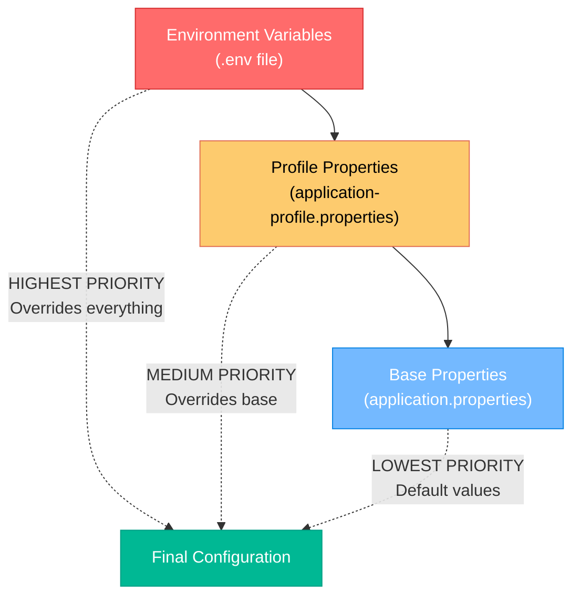
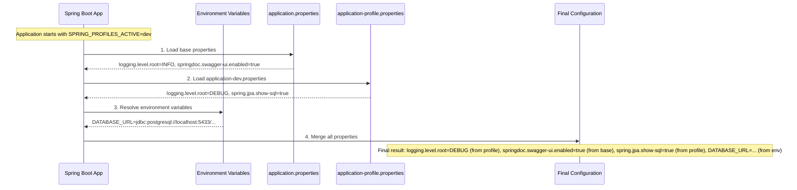
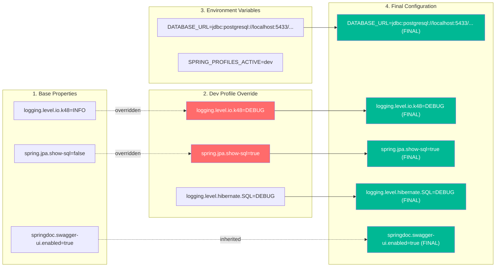
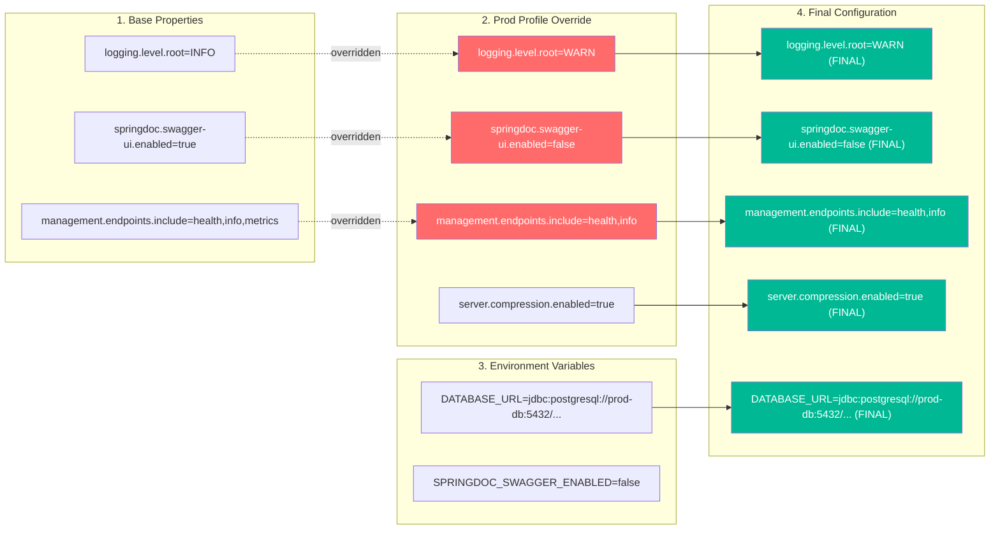
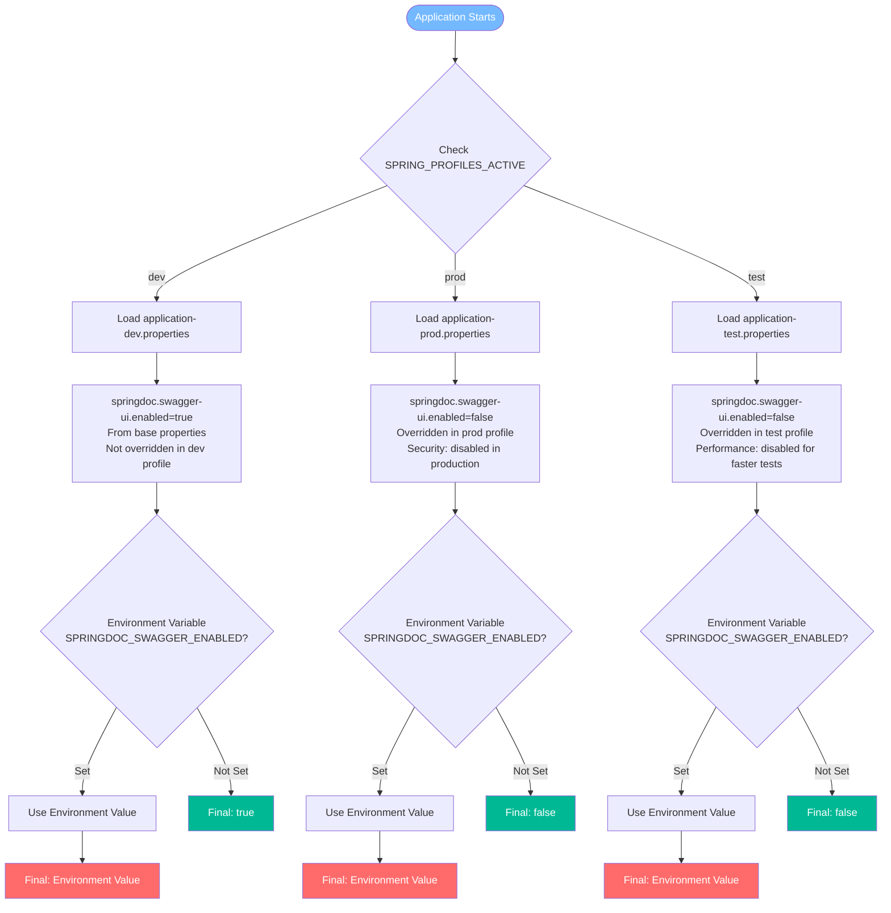

# Environment Setup Guide

This guide explains how to configure 48ID for different environments using our unified environment variable strategy.

## Quick Start

1. **Copy the environment template:**
   ```bash
   cp .env.example .env
   ```

2. **Choose your environment profile** by setting `SPRING_PROFILES_ACTIVE` in your `.env` file:
   - `dev` - Development (default)
   - `test` - Testing/CI
   - `prod` - Production

3. **Start required services:**
   ```bash
   # For development
   docker compose up -d db redis mailpit
   
   # Run the application
   ./gradlew bootRun
   ```

## Environment Profiles

### Development (`dev`)
- **Purpose**: Local development with debugging tools
- **Features**:
  - Detailed SQL logging
  - Swagger UI enabled at `/api/v1/docs`
  - Debug-level logging for application code
  - Uses Docker Compose services (PostgreSQL on port 5433, Redis, Mailpit)

### Testing (`test`)
- **Purpose**: Automated testing and CI/CD
- **Features**:
  - Testcontainers for isolated database testing
  - Mock email services
  - Faster startup (Swagger disabled)
  - Separate Redis port to avoid conflicts

### Production (`prod`)
- **Purpose**: Production deployment
- **Features**:
  - Swagger UI disabled for security
  - Minimal logging (WARN level)
  - Compression enabled
  - Restricted actuator endpoints

## Environment Variables

All configuration is done through environment variables with sensible defaults. The `.env.example` file contains all available options with documentation.

### Key Variables

| Variable | Description | Dev Default | Prod Example |
|----------|-------------|-------------|--------------|
| `SPRING_PROFILES_ACTIVE` | Environment profile | `dev` | `prod` |
| `DATABASE_URL` | PostgreSQL connection | `localhost:5433` | `prod-db.example.com:5432` |
| `REDIS_HOST` | Redis server | `localhost` | `prod-redis.example.com` |
| `MAIL_HOST` | SMTP server | `localhost` (Mailpit) | `smtp.sendgrid.net` |
| `CORS_ALLOWED_ORIGINS` | Frontend URLs | `http://localhost:3000` | `https://app.yourdomain.com` |
| `SPRINGDOC_SWAGGER_ENABLED` | API docs | `true` | `false` |

## Docker Compose Services

The `docker-compose.yml` provides development services:

- **`db`**: PostgreSQL 17 database (port 5433)
- **`redis`**: Redis 7.4 for sessions and rate limiting
- **`mailpit`**: Email testing tool with web UI at http://localhost:8025

### Service Commands

```bash
# Start all services
docker compose up -d

# Start specific services
docker compose up -d db redis mailpit

# View logs
docker compose logs -f db

# Stop services
docker compose down
```

## Environment-Specific Setup

### Development Setup

1. Copy `.env.example` to `.env`
2. Ensure `SPRING_PROFILES_ACTIVE=dev`
3. Start Docker services: `docker compose up -d db redis mailpit`
4. Run application: `./gradlew bootRun`
5. Access Swagger UI: http://localhost:8080/api/v1/docs
6. View emails: http://localhost:8025

### Production Setup

1. Create `.env.prod` with production values:
   ```bash
   SPRING_PROFILES_ACTIVE=prod
   DATABASE_URL=jdbc:postgresql://your-prod-db:5432/fortyeightid
   DATABASE_USERNAME=prod_user
   DATABASE_PASSWORD=secure_password
   REDIS_HOST=your-prod-redis
   REDIS_PASSWORD=redis_password
   MAIL_HOST=smtp.sendgrid.net
   MAIL_PORT=587
   MAIL_USERNAME=apikey
   MAIL_PASSWORD=your_sendgrid_api_key
   MAIL_SMTP_AUTH=true
   MAIL_SMTP_STARTTLS=true
   JWT_ISSUER=https://id.yourdomain.com
   CORS_ALLOWED_ORIGINS=https://app.yourdomain.com
   SPRINGDOC_SWAGGER_ENABLED=false
   ```

2. Generate production RSA keys (see Security section)
3. Deploy using your preferred method (Docker, JAR, etc.)

### Testing Setup

For CI/CD, create `.env.test`:
```bash
SPRING_PROFILES_ACTIVE=test
# Most values will use application-test.properties defaults
```

## Security Considerations

### JWT Keys
- **Development**: Uses provided keys in `src/main/resources/keys/`
- **Production**: Generate new RSA key pair and store securely

### Database
- **Development**: Uses Docker with default credentials
- **Production**: Use managed database service with strong credentials

### Email
- **Development**: Uses Mailpit (no real emails sent)
- **Production**: Use reputable SMTP service (SendGrid, AWS SES, etc.)

## Troubleshooting

### Common Issues

1. **Port conflicts**: Change `DATABASE_HOST_PORT` if 5433 is in use
2. **Docker not running**: Ensure Docker is started before `docker compose up`
3. **Permission errors**: Check file permissions on `.env` file
4. **Database connection**: Verify PostgreSQL is running and accessible

### Logs

View application logs with different detail levels:
- **Development**: DEBUG level with SQL logging
- **Production**: INFO level, minimal output

### Health Checks

Access health endpoints:
- Development: http://localhost:8080/actuator/health
- Production: Limited to basic health info

## Migration from Old Setup

If you have existing environment files:

1. **Backup** your current `.env` and profile-specific files
2. **Copy** `.env.example` to `.env`
3. **Migrate** your custom values to the new `.env` file
4. **Test** with `./gradlew bootRun`
5. **Remove** old environment files once confirmed working

The new setup consolidates all environment configuration into a single `.env` file with profile-based overrides, making it easier to manage and deploy across different environments.

## Understanding Spring Boot Profile Loading

### How Property Loading Works

Spring Boot uses a **hierarchical property loading system** where properties are loaded in a specific order, and **later sources override earlier ones**. This is crucial to understand for effective configuration management.

#### Property Loading Priority (Highest to Lowest)



#### Profile Loading Sequence



### Property Resolution Examples

#### Example 1: Development Profile (`SPRING_PROFILES_ACTIVE=dev`)



#### Example 2: Production Profile (`SPRING_PROFILES_ACTIVE=prod`)



### Key Principles

#### 1. Properties are MERGED, not REPLACED

When you activate a profile, Spring Boot doesn't discard `application.properties`. Instead:

- **Base properties** provide defaults for all environments
- **Profile properties** override only what needs to be different
- **Environment variables** provide deployment-specific values

#### 2. Environment Variables Have Ultimate Priority

```properties
# application.properties
spring.datasource.url=${DATABASE_URL:jdbc:postgresql://localhost:5432/fortyeightid}
#                      ↑              ↑
#                   env var        fallback default

# .env file  
DATABASE_URL=jdbc:postgresql://localhost:5433/fortyeightid

# Result: Uses 5433 (from env var), not 5432 (fallback)
```

#### 3. Profile Auto-Detection

Spring Boot automatically loads the correct profile files:

```bash
SPRING_PROFILES_ACTIVE=dev
# Automatically loads:
# 1. application.properties
# 2. application-dev.properties  ← detected automatically
```

### Practical Configuration Strategy

#### File Organization

```
src/main/resources/
├── application.properties          # Base configuration (common to all environments)
├── application-dev.properties      # Development overrides
├── application-test.properties     # Testing overrides
└── application-prod.properties     # Production overrides
```

#### What Goes Where

**`application.properties` (Base)**:
- Database connection templates with environment variable placeholders
- Common Spring Boot settings
- Default logging levels
- Feature flags with environment variable overrides

**`application-dev.properties` (Development)**:
- Debug logging levels
- SQL query logging
- Development tool enablement (Swagger, etc.)

**`application-prod.properties` (Production)**:
- Security hardening
- Performance optimizations
- Minimal logging
- Disabled development features

**Environment Variables (`.env`)**:
- Database credentials and URLs
- External service configurations
- Deployment-specific values
- Profile selection

### Real-World Example

Let's trace a complete property resolution:

**Property**: `springdoc.swagger-ui.enabled`



### Best Practices

1. **Keep base properties environment-agnostic**
2. **Use environment variables for sensitive data**
3. **Profile properties should only contain overrides**
4. **Document why each override exists**
5. **Test configuration in all target environments**

### Debugging Configuration

To see which properties are loaded and their sources:

```bash
# Enable configuration debugging
java -jar app.jar --debug --trace

# Or add to application.properties
logging.level.org.springframework.boot.context.config=DEBUG
```

This will show you exactly which files are loaded and how properties are resolved.

## Quick Reference

### Profile Activation

| Method | Example | Use Case |
|--------|---------|----------|
| Environment Variable | `SPRING_PROFILES_ACTIVE=dev` | Most common, set in `.env` |
| Command Line | `java -jar app.jar --spring.profiles.active=prod` | Override for specific runs |
| IDE Configuration | VM Options: `-Dspring.profiles.active=test` | Development/debugging |

### Property Priority (Highest to Lowest)

1. **Environment Variables** (`.env` file)
2. **Profile Properties** (`application-{profile}.properties`)
3. **Base Properties** (`application.properties`)

### Common Patterns

```properties
# Template pattern with fallback
property.name=${ENV_VAR_NAME:default-value}

# Profile-specific override
# application.properties:     logging.level.root=INFO
# application-dev.properties: logging.level.root=DEBUG

# Environment-only configuration
# .env: DATABASE_PASSWORD=secret123
# application.properties: spring.datasource.password=${DATABASE_PASSWORD}
```

### Profile File Loading

```
SPRING_PROFILES_ACTIVE=dev
├── application.properties          ✓ Always loaded
├── application-dev.properties      ✓ Loaded (profile match)
├── application-prod.properties     ✗ Not loaded
└── application-test.properties     ✗ Not loaded
```