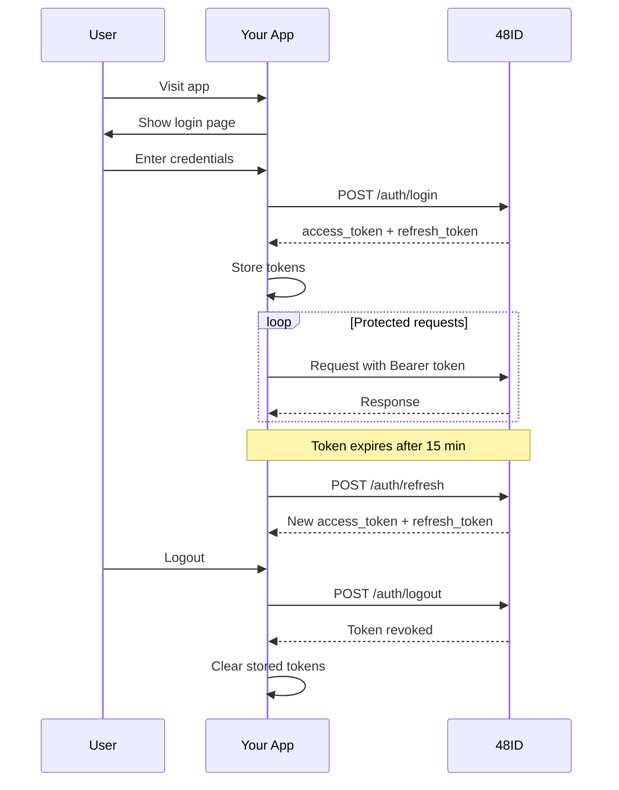

# Integration Guide

This guide explains how to integrate your application with 48ID for authentication and user management.

## Integration Patterns

48ID supports two integration patterns depending on your use case:

| Pattern | Use Case | Authentication Method |
|---------|----------|----------------------|
| **User-facing app** | Frontend apps (48Hub, LP48) | JWT Bearer tokens |
| **Backend service** | Server-to-server communication | API keys |

---

## Pattern 1: User-Facing Application

Use this pattern when your application **authenticates end users** directly (e.g., 48Hub, LP48).

### Quick Start

```javascript
// 1. User logs in
const loginResponse = await fetch('http://localhost:8080/api/v1/auth/login', {
  method: 'POST',
  headers: { 'Content-Type': 'application/json' },
  body: JSON.stringify({
    matricule: 'K48-2024-001',
    password: 'userPassword'
  })
});

const { access_token, refresh_token, user } = await loginResponse.json();

// 2. Store tokens securely
// ✅ Good: Memory or secure storage
// ❌ Bad: localStorage (XSS risk)
sessionStorage.setItem('access_token', access_token);
// Better: HttpOnly cookie for refresh_token

// 3. Use access token for API calls
const profileResponse = await fetch('http://localhost:8080/api/v1/me', {
  headers: {
    'Authorization': `Bearer ${access_token}`
  }
});

const profile = await profileResponse.json();
```

### Complete Flow



### Handling Token Expiration

Access tokens expire after **15 minutes**. Implement refresh logic:

```javascript
async function fetchWithAuth(url, options = {}) {
  let accessToken = getAccessToken();
  
  // Try request with current token
  let response = await fetch(url, {
    ...options,
    headers: {
      ...options.headers,
      'Authorization': `Bearer ${accessToken}`
    }
  });
  
  // If token expired, refresh and retry
  if (response.status === 401) {
    const refreshToken = getRefreshToken();
    
    const refreshResponse = await fetch('http://localhost:8080/api/v1/auth/refresh', {
      method: 'POST',
      headers: { 'Content-Type': 'application/json' },
      body: JSON.stringify({ refresh_token: refreshToken })
    });
    
    if (refreshResponse.ok) {
      const { access_token, refresh_token } = await refreshResponse.json();
      setAccessToken(access_token);
      setRefreshToken(refresh_token);
      
      // Retry original request
      response = await fetch(url, {
        ...options,
        headers: {
          ...options.headers,
          'Authorization': `Bearer ${access_token}`
        }
      });
    } else {
      // Refresh failed, redirect to login
      redirectToLogin();
    }
  }
  
  return response;
}
```

### Handling First-Time Password Change

If `requires_password_change` is `true` in the login response, prompt the user to change their password:

```javascript
const { access_token, requires_password_change, user } = await loginResponse.json();

if (requires_password_change) {
  // Show password change dialog
  const newPassword = await promptPasswordChange();
  
  await fetch('http://localhost:8080/api/v1/auth/change-password', {
    method: 'POST',
    headers: {
      'Authorization': `Bearer ${access_token}`,
      'Content-Type': 'application/json'
    },
    body: JSON.stringify({
      currentPassword: originalPassword,
      newPassword: newPassword
    })
  });
}
```

---

## Pattern 2: Backend Service Integration

Use this pattern when your **backend service** needs to verify user tokens or query identity data.

### Get an API Key

1. Contact K48 administration
2. Provide your application name and description
3. Admin creates API key via 48ID admin panel
4. **Store the key securely** — it's only shown once

### Verify User Tokens

```bash
curl -X POST http://localhost:8080/api/v1/auth/verify-token \
  -H "X-API-Key: your-api-key" \
  -H "Content-Type: application/json" \
  -d '{"token":"user-jwt-token"}'
```

**Success response:**
```json
{
  "valid": true,
  "user": {
    "id": "uuid",
    "matricule": "K48-2024-001",
    "name": "Ama Owusu",
    "email": "ama@k48.io",
    "role": "STUDENT",
    "batch": "2024",
    "specialization": "Software Engineering"
  }
}
```

**Invalid token response:**
```json
{
  "valid": false,
  "reason": "TOKEN_EXPIRED"
}
```

### Query Public Identity

```bash
# Get public identity by user ID
curl -X GET http://localhost:8080/api/v1/users/{user-id}/identity \
  -H "X-API-Key: your-api-key"

# Check if matricule exists
curl -X GET http://localhost:8080/api/v1/users/K48-2024-001/exists \
  -H "X-API-Key: your-api-key"
```

### Node.js Example

```javascript
const fetch = require('node-fetch');

const API_KEY = process.env.FORTYEIGHTID_API_KEY;

async function verifyUserToken(token) {
  const response = await fetch('http://localhost:8080/api/v1/auth/verify-token', {
    method: 'POST',
    headers: {
      'X-API-Key': API_KEY,
      'Content-Type': 'application/json'
    },
    body: JSON.stringify({ token })
  });
  
  const result = await response.json();
  
  if (result.valid) {
    return result.user;
  } else {
    throw new Error(`Token invalid: ${result.reason}`);
  }
}

// Usage in Express middleware
app.use(async (req, res, next) => {
  const authHeader = req.headers.authorization;
  if (!authHeader) return res.status(401).send('Missing Authorization header');
  
  const token = authHeader.replace('Bearer ', '');
  
  try {
    const user = await verifyUserToken(token);
    req.user = user;
    next();
  } catch (err) {
    res.status(401).send('Invalid token');
  }
});
```

### Python Example

```python
import os
import requests

API_KEY = os.getenv('FORTYEIGHTID_API_KEY')
BASE_URL = 'http://localhost:8080/api/v1'

def verify_user_token(token: str) -> dict:
    response = requests.post(
        f'{BASE_URL}/auth/verify-token',
        headers={
            'X-API-Key': API_KEY,
            'Content-Type': 'application/json'
        },
        json={'token': token}
    )
    
    result = response.json()
    
    if result['valid']:
        return result['user']
    else:
        raise ValueError(f"Token invalid: {result['reason']}")

# Usage in Flask
from flask import request, abort

@app.before_request
def authenticate():
    auth_header = request.headers.get('Authorization')
    if not auth_header:
        abort(401, 'Missing Authorization header')
    
    token = auth_header.replace('Bearer ', '')
    
    try:
        user = verify_user_token(token)
        request.user = user
    except ValueError:
        abort(401, 'Invalid token')
```

---

## Pattern 3: Local JWT Validation (Advanced)

For **high-performance** scenarios, validate JWTs locally using JWKS instead of calling `/verify-token`.

### Fetch JWKS

```bash
curl http://localhost:8080/.well-known/jwks.json
```

**Response:**
```json
{
  "keys": [
    {
      "kty": "RSA",
      "kid": "48id-2024",
      "use": "sig",
      "alg": "RS256",
      "n": "...",
      "e": "AQAB"
    }
  ]
}
```

### Node.js Example (using `jose`)

```javascript
const { jwtVerify, createRemoteJWKSet } = require('jose');

const JWKS_URL = 'http://localhost:8080/.well-known/jwks.json';
const jwks = createRemoteJWKSet(new URL(JWKS_URL));

async function validateJWT(token) {
  try {
    const { payload } = await jwtVerify(token, jwks, {
      issuer: 'http://localhost:8080',
      audience: undefined // 48ID doesn't set aud claim in MVP
    });
    
    return payload;
  } catch (err) {
    throw new Error(`JWT validation failed: ${err.message}`);
  }
}
```

**⚠️ Important:** Local validation only checks **signature** and **expiration**. It does not check:
- User status (`ACTIVE`, `SUSPENDED`)
- Token revocation
- Role changes

Use `/verify-token` if you need **status-aware validation**.

---

## Security Best Practices

### For Frontend Apps

✅ **DO:**
- Use HTTPS in production
- Store access tokens in memory (not localStorage)
- Use HttpOnly cookies for refresh tokens
- Implement CSRF protection if using cookies
- Clear tokens on logout

❌ **DON'T:**
- Store tokens in localStorage (XSS vulnerable)
- Log tokens in console or analytics
- Send tokens over HTTP
- Ignore `requires_password_change`

### For Backend Services

✅ **DO:**
- Store API keys in environment variables or secret managers
- Rotate API keys periodically
- Use different keys per environment (dev, staging, prod)
- Monitor for invalid token patterns
- Implement rate limiting on your end

❌ **DON'T:**
- Commit API keys to source control
- Share API keys across applications
- Log API keys in application logs
- Use API keys in client-side code

---

## Error Handling

### Common Error Codes

| Code | HTTP Status | Meaning | Action |
|------|-------------|---------|--------|
| `INVALID_CREDENTIALS` | 401 | Wrong matricule or password | Prompt user to retry |
| `ACCOUNT_NOT_ACTIVATED` | 401 | User hasn't activated account | Show activation instructions |
| `ACCOUNT_SUSPENDED` | 401 | Account disabled by admin | Contact support |
| `ACCOUNT_LOCKED` | 401 | Too many failed attempts | Wait or contact support |
| `TOKEN_EXPIRED` | 401 | Access token expired | Refresh token |
| `REFRESH_TOKEN_INVALID` | 401 | Refresh token invalid/expired | Re-authenticate |
| `PASSWORD_POLICY_VIOLATION` | 400 | Password doesn't meet requirements | Show policy to user |

### Error Response Format

All errors follow RFC 7807 Problem Details:

```json
{
  "type": "https://48id.k48.io/errors/account-disabled",
  "title": "Account Disabled",
  "status": 401,
  "detail": "Your account is pending activation. Please activate it first.",
  "timestamp": "2026-03-12T14:46:39Z",
  "code": "ACCOUNT_NOT_ACTIVATED"
}
```

---

## Testing Your Integration

### Local Setup

1. Start 48ID locally (see [Quick Start](quickstart.md))
2. Create test users via admin panel or CSV import
3. Test login → token refresh → logout flow

### Create Test User

```bash
# 1. Login as admin
ACCESS_TOKEN=$(curl -X POST http://localhost:8080/api/v1/auth/login \
  -H "Content-Type: application/json" \
  -d '{"matricule":"ADMIN-001","password":"admin123"}' \
  | jq -r '.access_token')

# 2. Create test user via CSV
cat > test-users.csv <<EOF
matricule,email,name,phone,batch,specialization
K48-TEST-001,test@k48.io,Test User,+237600000000,2024,Software Engineering
EOF

curl -X POST http://localhost:8080/api/v1/admin/users/import \
  -H "Authorization: Bearer $ACCESS_TOKEN" \
  -F "file=@test-users.csv"

# 3. Check activation email in Mailpit (http://localhost:8025)
```

---

## API Reference

For complete endpoint documentation:

- **[Authentication API](../api/authentication.md)** — Login, refresh, password flows
- **[Identity API](../api/identity.md)** — User profile operations
- **[Integration API](../api/integration.md)** — Token verification, public identity
- **[Error Model](../api/errors.md)** — Complete error reference

---

## Examples

### React Integration

```jsx
import { useState, useEffect } from 'react';

function useAuth() {
  const [user, setUser] = useState(null);
  const [loading, setLoading] = useState(true);
  
  useEffect(() => {
    const token = sessionStorage.getItem('access_token');
    if (token) {
      fetch('http://localhost:8080/api/v1/me', {
        headers: { 'Authorization': `Bearer ${token}` }
      })
        .then(res => res.json())
        .then(setUser)
        .finally(() => setLoading(false));
    } else {
      setLoading(false);
    }
  }, []);
  
  const login = async (matricule, password) => {
    const response = await fetch('http://localhost:8080/api/v1/auth/login', {
      method: 'POST',
      headers: { 'Content-Type': 'application/json' },
      body: JSON.stringify({ matricule, password })
    });
    
    if (!response.ok) throw new Error('Login failed');
    
    const { access_token, refresh_token, user } = await response.json();
    sessionStorage.setItem('access_token', access_token);
    sessionStorage.setItem('refresh_token', refresh_token);
    setUser(user);
  };
  
  const logout = async () => {
    const refresh_token = sessionStorage.getItem('refresh_token');
    await fetch('http://localhost:8080/api/v1/auth/logout', {
      method: 'POST',
      headers: { 'Content-Type': 'application/json' },
      body: JSON.stringify({ refresh_token })
    });
    sessionStorage.clear();
    setUser(null);
  };
  
  return { user, loading, login, logout };
}
```

### Next.js API Route

```javascript
// pages/api/protected.js
export default async function handler(req, res) {
  const authHeader = req.headers.authorization;
  if (!authHeader) {
    return res.status(401).json({ error: 'Missing authorization' });
  }
  
  const token = authHeader.replace('Bearer ', '');
  
  const verifyResponse = await fetch('http://localhost:8080/api/v1/auth/verify-token', {
    method: 'POST',
    headers: {
      'X-API-Key': process.env.FORTYEIGHTID_API_KEY,
      'Content-Type': 'application/json'
    },
    body: JSON.stringify({ token })
  });
  
  const { valid, user } = await verifyResponse.json();
  
  if (!valid) {
    return res.status(401).json({ error: 'Invalid token' });
  }
  
  // User is authenticated
  res.json({ message: 'Protected data', user });
}
```

---

## Support

Need help integrating?

- Read the [Authentication Guide](authentication.md)
- Check the [API Reference](../api)
- Review [example code](#examples)
- Contact K48 administration for API keys
