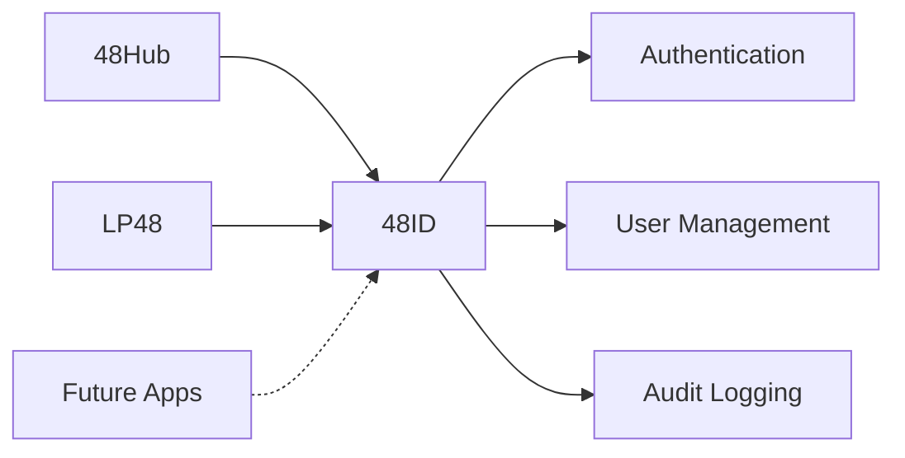

# Introduction to 48ID

## What is 48ID?

**48ID** is the centralized identity and authentication service for the K48 ecosystem. It provides a single, secure backend for user authentication, JWT token management, user provisioning, role-based authorization, and audit logging.

Instead of each K48 application implementing its own authentication, they all rely on 48ID as the **single source of truth** for identity.

## The K48 Ecosystem

48ID powers authentication for:

- **[48Hub](https://github.com/mrvin100/48hub)** — Alumni verification and networking platform
- **[LP48](https://github.com/mrvin100/lp48)** — Student project showcase platform
- **Future K48 applications** — Any new platform can integrate with 48ID

## MVP Scope

The current MVP includes:

### Core authentication
- JWT-based login with access and refresh tokens
- Account activation via email token
- Password reset and password change flows
- JWKS endpoint for JWT validation

### User management
- Self-service profile updates
- Admin user lifecycle operations
- Role-based authorization (`ADMIN`, `STUDENT`)
- Account status management (`ACTIVE`, `PENDING_ACTIVATION`, `SUSPENDED`)

### Provisioning
- CSV-based bulk user import
- Automatic activation email sending
- Temporary password generation

### Integration
- API key management for trusted applications
- Token verification endpoint
- Public identity lookup endpoints
- Rate limiting and security controls

### Audit
- Complete audit trail for security-relevant events
- Login history tracking
- Admin action logging

## What's NOT in the MVP

- OAuth 2.0 / OpenID Connect provider
- Social login (Google, GitHub, etc.)
- Multi-factor authentication (MFA)
- SCIM provisioning
- Multi-tenancy
- Custom permission systems beyond roles

These features are planned for future phases.

## Primary Users

### Students
- Authenticate to K48 applications
- Activate their account on first use
- Update their profile
- Change their password

### Administrators
- Provision new users via CSV import
- Manage user accounts (activate, suspend, unlock)
- Review audit logs and login history
- Create and rotate API keys for integrations

### Trusted Applications
- Verify user JWT tokens server-to-server
- Query public identity information
- Check if a matricule exists in the system

## Design Principles

48ID is built on these core principles:

1. **Single source of truth** — One identity system for the entire K48 ecosystem
2. **Security by default** — Secure defaults for tokens, passwords, rate limits
3. **Explicit module boundaries** — Spring Modulith architecture enforces clean separation
4. **Operational transparency** — Complete audit trail for accountability
5. **Developer-friendly** — Clear APIs, good docs, easy integration
6. **Extensible** — Designed to scale beyond MVP without breaking changes

## Architecture at a Glance

48ID is a **Spring Boot 3** application using **Spring Modulith** for modular architecture:

- **Backend:** Spring Boot, Spring Security, Spring Data JPA
- **Database:** PostgreSQL with Flyway migrations
- **Cache/Session:** Redis
- **Security:** RS256 JWT, refresh tokens, API keys, rate limiting
- **API:** REST with OpenAPI documentation

Module structure:
- `auth` — authentication, JWT, password flows, activation
- `identity` — user entity, profiles, roles, status
- `admin` — privileged operations, API key management
- `provisioning` — CSV import, bulk user creation
- `audit` — audit event logging
- `shared` — security config, exceptions, infrastructure

## Next Steps

- **[Quick Start](quickstart.md)** — Run 48ID locally in 5 minutes
- **[Architecture](architecture.md)** — Detailed system design
- **[Authentication](authentication.md)** — How authentication works
- **[Integration](integration.md)** — How to integrate your app
