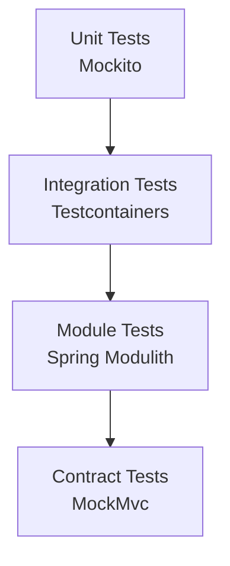

# Testing Guide

This guide explains how to test 48ID and write tests for new features.

## Test Strategy

48ID uses a layered testing approach:



## Running Tests

### Run All Tests

```bash
./gradlew test

# Windows
.\gradlew.bat test
```

### Run Specific Test Class

```bash
./gradlew test --tests "AuthServiceTest"
```

### Run Tests with Coverage

```bash
./gradlew test jacocoTestReport

# View report at: build/reports/jacoco/test/html/index.html
```

### Run Module Boundary Tests

```bash
./gradlew test --tests "ApplicationModularityTests"
```

This validates Spring Modulith module boundaries are respected.

## Test Types

### Unit Tests

Test business logic with mocked dependencies using **Mockito**.

**Example:**

```java
@ExtendWith(MockitoExtension.class)
class PasswordPolicyServiceTest {

    @InjectMocks
    private PasswordPolicyService passwordPolicyService;

    @Test
    void validate_shouldPass_whenPasswordMeetsAllRequirements() {
        // Given
        String validPassword = "SecurePass@123";

        // When / Then
        assertDoesNotThrow(() -> passwordPolicyService.validate(validPassword));
    }

    @Test
    void validate_shouldThrow_whenPasswordIsTooShort() {
        // Given
        String shortPassword = "Short1!";

        // When / Then
        assertThatThrownBy(() -> passwordPolicyService.validate(shortPassword))
                .isInstanceOf(PasswordPolicyViolationException.class);
    }
}
```

### Integration Tests

Test full flows with real PostgreSQL and Redis using **Testcontainers**.

**Example:**

```java
@SpringBootTest
@ActiveProfiles("test")
@Import(TestcontainersConfiguration.class)
@Transactional
class UserProvisioningIntegrationTest {

    @Autowired
    private UserProvisioningPort userProvisioningService;

    @Autowired
    private UserRepository userRepository;

    @Test
    void createUser_persistsToDatabase() {
        // Given
        String matricule = "K48-2024-TEST-001";

        // When
        var user = userProvisioningService.createUser(
            matricule, "test@k48.io", "Test User",
            "+237600000000", "2024", "SE", "TempPass123"
        );

        // Then
        var savedUser = userRepository.findByMatricule(matricule);
        assertThat(savedUser).isPresent();
        assertThat(savedUser.get().getStatus()).isEqualTo(UserStatus.PENDING_ACTIVATION);
    }
}
```

### Contract Tests

Test HTTP endpoints with **MockMvc**.

**Example:**

```java
@WebMvcTest(AuthController.class)
class AuthControllerTest {

    @Autowired
    private MockMvc mockMvc;

    @MockBean
    private AuthService authService;

    @Test
    void login_returns200AndTokens_whenCredentialsValid() throws Exception {
        // Given
        var loginResponse = new LoginResponse(
            "access-token", "refresh-token", "Bearer", 900, false,
            new LoginResponse.UserInfo("uuid", "K48-2024-001", "Test", "STUDENT", "2024", "SE")
        );
        when(authService.login(any())).thenReturn(loginResponse);

        // When / Then
        mockMvc.perform(post("/api/v1/auth/login")
                .contentType(MediaType.APPLICATION_JSON)
                .content("{\"matricule\":\"K48-2024-001\",\"password\":\"password\"}"))
                .andExpect(status().isOk())
                .andExpect(jsonPath("$.access_token").value("access-token"));
    }
}
```

## Test Configuration

### Testcontainers Setup

`TestcontainersConfiguration.java` provides PostgreSQL and Redis containers:

```java
@TestConfiguration(proxyBeanMethods = false)
public class TestcontainersConfiguration {

    @Bean
    @ServiceConnection
    PostgreSQLContainer<?> postgresContainer() {
        return new PostgreSQLContainer<>("postgres:17-alpine");
    }

    @Bean
    @ServiceConnection
    RedisContainer redisContainer() {
        return new RedisContainer("redis:7-alpine");
    }
}
```

### Test Profile

`application-test.properties` configures test environment:

```properties
spring.jpa.hibernate.ddl-auto=validate
spring.flyway.clean-disabled=false
logging.level.io.k48.fortyeightid=DEBUG
```

## Writing Tests

### Test Naming Convention

```java
void methodName_shouldExpectedBehavior_whenCondition()
```

**Examples:**
- `login_shouldReturnTokens_whenCredentialsValid()`
- `createUser_shouldThrow_whenMatriculeExists()`
- `updateProfile_shouldPersistChanges_whenFieldsValid()`

### Given-When-Then Pattern

```java
@Test
void example() {
    // Given - Set up test data and mocks
    var user = createTestUser();
    when(userRepository.findById(user.getId())).thenReturn(Optional.of(user));

    // When - Execute the code under test
    var result = userService.getUser(user.getId());

    // Then - Assert expected outcomes
    assertThat(result).isNotNull();
    verify(userRepository).findById(user.getId());
}
```

### Coverage Goals

- **New code:** 80%+ coverage
- **Critical paths:** 100% coverage (auth, provisioning, password flows)
- **Edge cases:** Always test error conditions

## CI/CD Integration

Tests run automatically on:
- Every push to feature branches
- Every pull request
- Before merging to main

GitHub Actions workflow:

```yaml
- name: Run tests
  run: ./gradlew test

- name: Upload coverage
  uses: codecov/codecov-action@v3
```

## Common Test Patterns

### Mock Email Service

```java
@MockBean
private EmailPort emailService;

@Test
void sendActivationEmail_isCalled() {
    // ... test logic
    verify(emailService).sendActivationEmail(
        eq("user@k48.io"), anyString(), anyString(), anyString(), anyString()
    );
}
```

### Test Time-Based Logic

```java
@Test
void token_shouldExpire_after15Minutes() {
    // Use Clock abstraction or test with actual time
    var token = createTokenWithExpiry(Instant.now().plusSeconds(900));
    assertThat(token.isExpired()).isFalse();

    // Advance time (if using Clock)
    assertThat(token.isExpiredAt(Instant.now().plusSeconds(901))).isTrue();
}
```

### Test Security

```java
@Test
@WithMockUser(roles = "ADMIN")
void adminEndpoint_allowsAccess_whenUserIsAdmin() {
    mockMvc.perform(get("/api/v1/admin/users"))
            .andExpect(status().isOk());
}

@Test
@WithMockUser(roles = "STUDENT")
void adminEndpoint_deniesAccess_whenUserIsStudent() {
    mockMvc.perform(get("/api/v1/admin/users"))
            .andExpect(status().isForbidden());
}
```

## Troubleshooting Tests

### Testcontainers Issues

**Problem:** Tests fail with "Docker not running"

**Solution:**
```bash
# Start Docker Desktop
# Or skip integration tests:
./gradlew test -x integrationTest
```

### Database State Issues

**Problem:** Tests fail due to dirty database state

**Solution:** Use `@Transactional` on test class for automatic rollback:

```java
@SpringBootTest
@Transactional  // Rolls back after each test
class MyIntegrationTest {
    // ...
}
```

### Flaky Tests

**Problem:** Tests pass/fail randomly

**Solution:**
- Avoid `Thread.sleep()` - use proper waiting mechanisms
- Don't rely on execution order
- Clean up test data properly
- Use `@DirtiesContext` sparingly

## Next Steps

- **[Contributing Guide](../developers/contributing.md)** — Development setup
- **[Story Workflow](../developers/story-workflow.md)** — Implementing features with TDD
- **[Architecture](architecture.md)** — Understanding module structure
