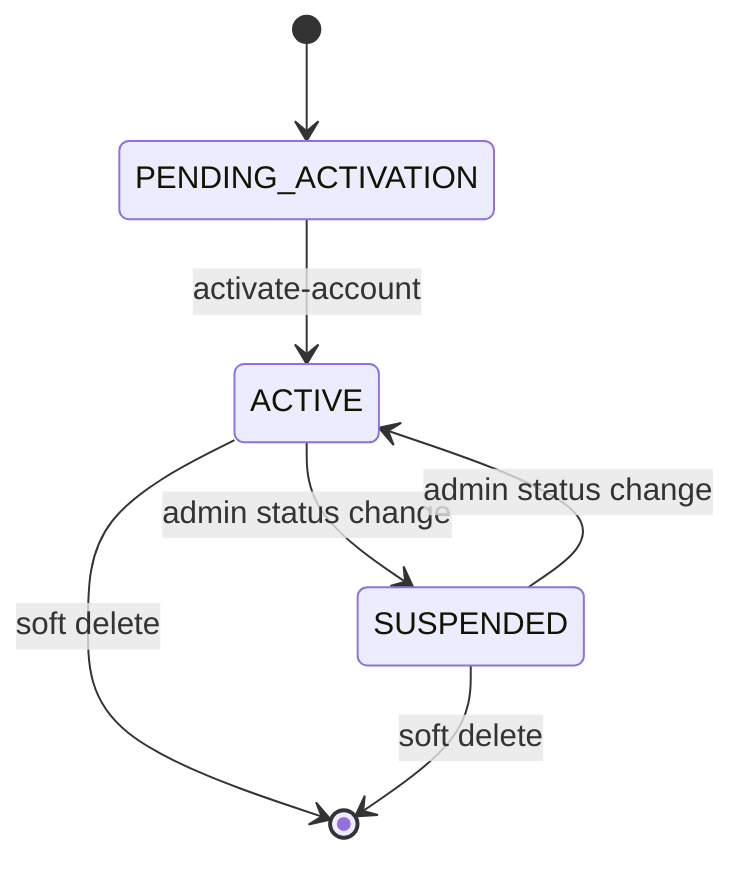

# Identity management guide

## User model in the MVP

The 48ID user record includes:

- `id`
- `matricule`
- `email`
- `name`
- `phone`
- `batch`
- `specialization`
- `status`
- assigned roles
- `profileCompleted`
- audit timestamps

## Status lifecycle

### `PENDING_ACTIVATION`

- created by provisioning flows
- cannot authenticate
- waits for activation token usage

### `ACTIVE`

- normal operational state
- can authenticate and use allowed endpoints

### `SUSPENDED`

- authentication blocked
- used by administrators for disciplinary or operational control

## Self-service boundary

End users can only manage their own limited profile fields in the MVP:

- phone
- specialization

Matricule, role, and lifecycle state remain administrative concerns.

## Public identity boundary

Trusted applications can access a reduced identity surface through API keys:

- public identity lookup by user ID
- matricule existence check

This intentionally avoids exposing the full user record to integration consumers.
