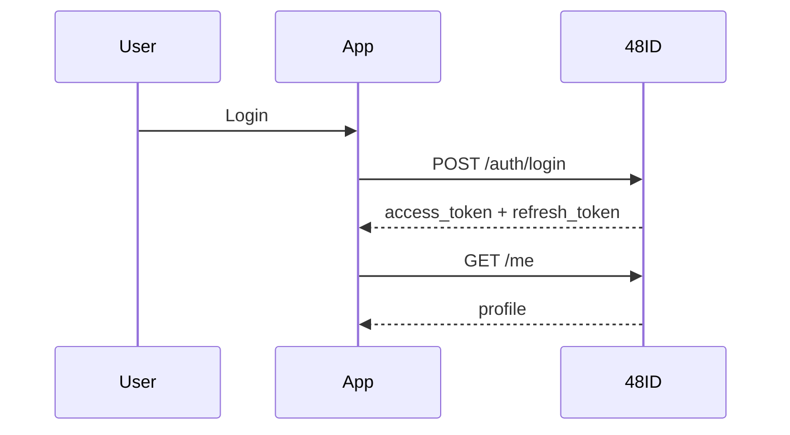

# Integration guide

This guide explains how an external K48 application integrates with 48ID in the MVP.

## Integration patterns

### User-facing application

Use this pattern when your application signs users in directly.

1. call `POST /api/v1/auth/login`
2. store the access token and refresh token securely
3. send `Authorization: Bearer <token>` to protected endpoints
4. rotate tokens through `POST /api/v1/auth/refresh`
5. call `POST /api/v1/auth/logout` when ending the session

### Trusted backend application

Use this pattern when your application receives user tokens and wants server-to-server verification.

1. request an API key from a 48ID admin
2. send `X-API-Key` on trusted integration endpoints
3. call `POST /api/v1/auth/verify-token`
4. optionally call public identity lookup endpoints when needed

## Example: verifying a token server-to-server

```bash
curl -X POST http://localhost:8080/api/v1/auth/verify-token \
  -H "Content-Type: application/json" \
  -H "X-API-Key: k48_live_xxx" \
  -d '{"token":"<access-token>"}'
```

## Example: validating JWTs locally with JWKS

Applications that validate JWTs locally should fetch keys from:

```text
http://localhost:8080/.well-known/jwks.json
```

Recommended steps:

- cache the JWKS with reasonable TTL
- validate signature, issuer, expiration, and expected claims
- still rely on `verify-token` if you need status-aware validation against current user state

## Recommended practices

- do not store access tokens in insecure browser storage if avoidable
- always use HTTPS outside local development
- isolate API keys per application and environment
- treat activation and reset tokens as secrets
- handle `requires_password_change=true` explicitly in the client
- distinguish token validation from authorization in your app logic

## Example client login sequence


