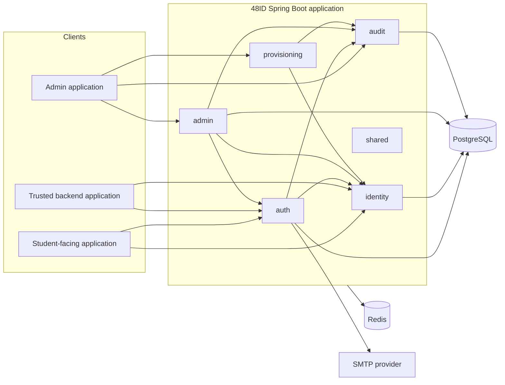
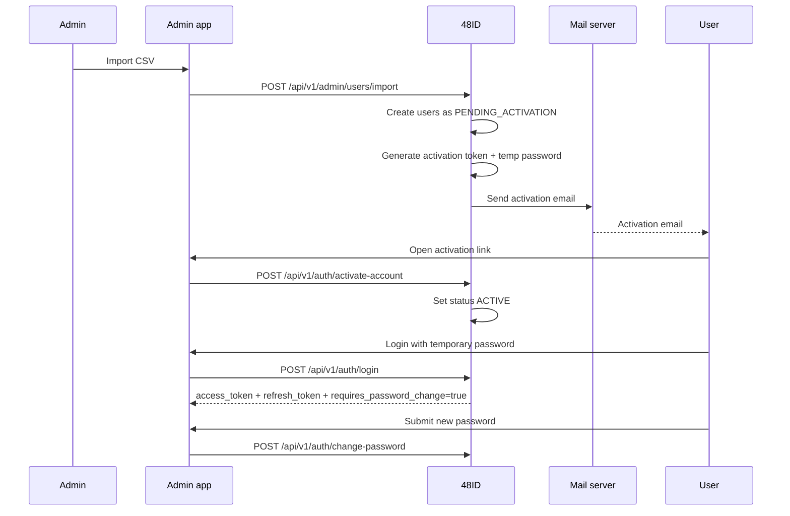

# Architecture

## System purpose

48ID provides centralized identity capabilities for the K48 ecosystem. Its MVP responsibility is to authenticate users, issue and validate JWTs, manage user lifecycle state, and expose controlled administrative and integration APIs.

## High-level architecture

## Spring Modulith structure

The codebase uses Spring Modulith to express domain modules and validate module boundaries.

### Modules

- `auth`: login, refresh, logout, JWT signing, JWKS, activation, password reset, API key verification
- `identity`: user aggregate, role and status state, self-service profile operations, provisioning boundary
- `admin`: privileged management of users, audit log access, API key administration
- `provisioning`: CSV import workflow for onboarding users in bulk
- `audit`: audit event persistence and query support
- `shared`: cross-cutting configuration, exception handling, rate limiting, OpenAPI, filters

### Boundary rules

The intended interaction model is:

- `identity` owns the user aggregate and user state transitions.
- `auth` depends on `identity` through public services and ports.
- `admin` coordinates privileged workflows and delegates domain changes to `identity` and `auth` ports.
- `provisioning` uses `identity` for user creation and `auth` for activation initialization.
- `audit` is consumed by other modules but remains focused on audit persistence and retrieval.

## Internal communication

Cross-module communication is synchronous in-process service invocation through Spring beans and exposed ports. There is no event bus in the MVP.

## Authentication architecture

48ID uses JWT bearer access tokens and refresh tokens.

- access tokens are used by clients for protected endpoints
- refresh tokens are used to rotate sessions and obtain new access tokens
- JWKS is published at `/.well-known/jwks.json`
- trusted backend integrations use API keys for token verification and public identity lookups

### Login and first activation sequence

## Authorization model

Authorization is role-based.

- `ADMIN` can access admin and provisioning operations.
- `STUDENT` can access self-service operations.
- `API_CLIENT` is assigned dynamically to authenticated API keys and is required for trusted integration endpoints.

Method-level authorization uses `@PreAuthorize` on privileged controllers.

## Database architecture

The primary store is PostgreSQL.

Main persisted concepts include:

- users
- roles and user-role relationships
- refresh tokens
- password/activation tokens
- API keys
- audit logs

Schema evolution is managed by Flyway migrations in `src/main/resources/db/migration`.

## Infrastructure components

- **PostgreSQL**: system of record for identities, tokens, API keys, and audits
- **Redis**: supporting infrastructure for rate limiting and cache-like concerns in the MVP environment
- **SMTP**: transactional email delivery for activation and password reset workflows
- **Springdoc OpenAPI**: interactive API documentation

## Deployment model

The repository includes:

- Dockerfile for container image build
- Docker Compose for local PostgreSQL and Redis
- GitHub Actions CI workflow for build and test validation

For production, deploy the application as a stateless container with external PostgreSQL, Redis, and SMTP services.
